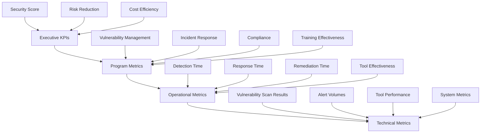

# Security Metrics & KPI Framework

## Executive Summary

This framework establishes a comprehensive metrics and Key Performance Indicator (KPI) system to measure, monitor, and improve the effectiveness of our security program. By implementing data-driven security measurement, we can demonstrate security value, optimize resource allocation, and make informed decisions about security investments and priorities.

**Key Objectives:**
- **Security Effectiveness Measurement** - Quantify security program effectiveness and impact
- **Resource Optimization** - Optimize security resource allocation and investments
- **Performance Improvement** - Drive continuous improvement through data-driven insights
- **Value Demonstration** - Demonstrate security value to stakeholders and leadership

**Target Audience:** Security Leadership, CISO, Security Teams, Executive Leadership, and Board of Directors.

---

## Introduction: Measuring What Matters

Security programs have historically struggled to demonstrate their value and effectiveness. This framework addresses that challenge by providing a structured approach to measuring security performance that aligns with business objectives and demonstrates security ROI.

By implementing comprehensive security metrics, we can move from anecdotal evidence to data-driven decision making, enabling us to:

- **Demonstrate security ROI** to executive leadership and board
- **Optimize security investments** based on performance data
- **Identify improvement opportunities** through metrics analysis
- **Benchmark performance** against industry standards and peers
- **Align security priorities** with business objectives and risk tolerance

## Security Metrics Framework Architecture

### Metrics Hierarchy



### Metrics Categories

| Category | Purpose | Audience | Frequency |
| :--- | :--- | :--- | :--- |
| **Executive KPIs** | Strategic security performance measurement | Executive Leadership, Board | Monthly/Quarterly |
| **Program Metrics** | Security program effectiveness measurement | Security Leadership, Program Managers | Monthly |
| **Operational Metrics** | Security operations performance measurement | Security Teams, Operations Managers | Weekly/Daily |
| **Technical Metrics** | Technical security control performance | Security Engineers, Tool Administrators | Real-time/Daily |

## Security Effectiveness Metrics

### 1. Vulnerability Management Effectiveness

#### Core Vulnerability Metrics

| Metric | Formula | Target | Data Source |
| :--- | :--- | :--- | :--- |
| **Vulnerability Discovery Rate** | New vulnerabilities discovered per month | Increasing (early detection) | SAST, DAST, Penetration testing |
| **Vulnerability Remediation Rate** | Remediated vulnerabilities ÷ Total vulnerabilities | > 95% within SLA | Vulnerability management system |
| **Mean Time to Remediate (MTTR)** | Average time from discovery to remediation | < 30 days (Critical: < 7 days) | Vulnerability management system |
| **Vulnerability Recurrence Rate** | Recurring vulnerabilities ÷ Total vulnerabilities | < 5% | Vulnerability management system |
| **Critical Vulnerability Time** | Time from critical discovery to remediation | < 72 hours | Vulnerability management system |

#### Advanced Vulnerability Metrics

**Vulnerability Trend Analysis:**
- **Vulnerability Velocity** - Rate of vulnerability introduction vs. remediation
- **Vulnerability Age Distribution** - Distribution of vulnerability ages
- **Vulnerability Risk Score** - Weighted risk score based on severity and exposure
- **Remediation Effectiveness** - Percentage of vulnerabilities remediated on first attempt
- **Vulnerability Coverage** - Percentage of assets covered by vulnerability scanning

**Business Impact Metrics:**
- **Risk Reduction** - Measurable reduction in security risk over time
- **Cost Avoidance** - Estimated cost avoided through proactive vulnerability management
- **Compliance Improvement** - Improvement in compliance scores and audit results
- **Service Availability** - Impact of vulnerabilities on service availability
- **Customer Trust** - Impact on customer trust and satisfaction

### 2. Incident Response Effectiveness

#### Incident Response Metrics

| Metric | Formula | Target | Data Source |
| :--- | :--- | :--- | :--- |
| **Mean Time to Detect (MTTD)** | Average time from incident start to detection | < 4 hours | SIEM, Security monitoring |
| **Mean Time to Respond (MTTR)** | Average time from detection to response initiation | < 1 hour | Incident response system |
| **Mean Time to Contain** | Average time from detection to incident containment | < 8 hours | Incident response system |
| **Mean Time to Resolve** | Average time from detection to incident resolution | < 24 hours | Incident response system |
| **Incident Response Cost** | Total cost of incident response activities | Track and optimize | Financial system, Time tracking |

#### Incident Response Quality Metrics

**Response Effectiveness:**
- **First-Call Resolution Rate** - Percentage of incidents resolved on first contact
- **Escalation Rate** - Percentage of incidents requiring escalation
- **Customer Impact** - Percentage of incidents affecting customers
- **Service Availability** - Impact on service availability during incidents
- **Data Loss Prevention** - Percentage of incidents with no data loss

**Response Process Metrics:**
- **Process Adherence** - Percentage of incidents following defined process
- **Documentation Quality** - Quality and completeness of incident documentation
- **Team Performance** - Individual and team performance metrics
- **Communication Effectiveness** - Quality and timeliness of incident communication
- **Learning Effectiveness** - Implementation of lessons learned and improvements

### 3. Security Control Effectiveness

#### Security Tool Metrics

| Tool Category | Metric | Target | Measurement Method |
| :--- | :--- | :--- | :--- |
| **SAST Tools** | False Positive Rate | < 10% | Tool reporting, Manual validation |
| **DAST Tools** | Coverage Rate | > 95% of applications | Tool reporting, Application inventory |
| **EDR Tools** | Detection Accuracy | > 90% accuracy | Tool validation, Incident correlation |
| **SIEM Tools** | Alert Accuracy | > 85% accurate alerts | Alert analysis, Tuning process |
| **Vulnerability Scanners** | Scan Coverage | > 90% of assets | Asset inventory, Scan results |

#### Control Effectiveness Measurement

**Preventive Controls:**
- **Access Control Effectiveness** - Success rate of access control enforcement
- **Network Security Effectiveness** - Success rate of network security controls
- **Endpoint Security Effectiveness** - Success rate of endpoint protection
- **Data Protection Effectiveness** - Success rate of data protection controls
- **Application Security Effectiveness** - Success rate of application security controls

**Detective Controls:**
- **Detection Accuracy** - Accuracy of security monitoring and detection
- **Alert Quality** - Quality and relevance of security alerts
- **Monitoring Coverage** - Coverage of security monitoring systems
- **Analysis Effectiveness** - Effectiveness of security analysis processes
- **Threat Intelligence Integration** - Effectiveness of threat intelligence integration

## Developer Security Performance Tracking

### 1. Developer Security Metrics

#### Secure Development Metrics

| Metric | Formula | Target | Data Source |
| :--- | :--- | :--- | :--- |
| **Secure Code Adoption Rate** | Developers using secure coding tools ÷ Total developers | > 90% | Tool usage analytics |
| **Security Defect Density** | Security defects ÷ Lines of code | < 1 per 1000 lines | Code analysis tools |
| **Pre-commit Security Success** | Security passes ÷ Total pre-commit runs | > 95% | CI/CD pipeline metrics |
| **Developer Security Training** | Training completion rate | 100% of developers | Training system |
| **Security Knowledge Score** | Assessment score average | > 85% | Security assessments |

#### Development Security Process Metrics

**IDE Security Metrics:**
- **IDE Security Tool Adoption** - Adoption rate of IDE security plugins
- **Real-time Vulnerability Detection** - Vulnerabilities detected in IDE
- **Developer Security Feedback** - Developer satisfaction with security tools
- **Productivity Impact** - Impact of security tools on development productivity
- **Tool Configuration Quality** - Quality of security tool configuration

**CI/CD Security Metrics:**
- **Security Gate Pass Rate** - Percentage of builds passing security gates
- **Security Test Coverage** - Coverage of security testing in CI/CD
- **Pipeline Security Time** - Time added by security testing in pipeline
- **False Positive Rate** - False positive rate of CI/CD security testing
- **Security Feedback Loop** - Feedback loop effectiveness for developers

### 2. Security Training Effectiveness

#### Training Metrics

| Training Type | Metric | Target | Measurement Method |
| :--- | :--- | :--- | :--- |
| **Security Awareness** | Knowledge retention rate | > 80% after 30 days | Pre/post training assessments |
| **Secure Coding** | Application of skills | 70% improvement in code reviews | Code review analysis |
| **Phishing Simulation** | Click rate reduction | < 5% click rate | Simulation results |
| **Security Champions** | Program effectiveness | 80% positive feedback | Participant surveys |
| **Compliance Training** | Compliance improvement | 100% compliance requirements | Compliance assessments |

#### Training Impact Metrics

**Behavioral Changes:**
- **Secure Coding Adoption** - Increase in secure coding practices
- **Security Mindset** - Improvement in security awareness and attitude
- **Tool Adoption** - Increase in security tool usage
- **Reporting Culture** - Increase in security incident reporting
- **Best Practice Adoption** - Adoption of security best practices

**Knowledge Retention:**
- **Short-term Retention** - Knowledge retention immediately after training
- **Long-term Retention** - Knowledge retention after 30, 60, 90 days
- **Application of Skills** - Practical application of trained skills
- **Continuous Learning** - Ongoing security learning activities
- **Knowledge Sharing** - Knowledge sharing within teams

### 3. Developer Security Incentives

#### Gamification Metrics

| Metric | Current | Target | Trend |
| :--- | :--- | :--- | :--- |
| **Security Score** | Developer security score | > 85 | Increasing |
| **Badge Achievement** | Security badges earned | 5 per developer | Increasing |
| **Team Ranking** | Team security ranking | Top 3 | Improving |
| **Participation Rate** | Program participation | > 90% | High |
| **Satisfaction Score** | Developer satisfaction | > 4.0/5.0 | High |

#### Recognition Program Metrics

**Program Effectiveness:**
- **Participation Rate** - Percentage of developers participating
- **Achievement Rate** - Percentage of participants achieving goals
- **Motivation Impact** - Impact on developer motivation
- **Team Performance** - Impact on team security performance
- **Cultural Impact** - Impact on security culture

**Business Impact:**
- **Security Improvement** - Measurable security improvements
- **Productivity Impact** - Impact on development productivity
- **Quality Impact** - Impact on code quality
- **Retention Impact** - Impact on employee retention
- **Innovation Impact** - Impact on security innovation

## ROI Measurement Framework

### 1. Security Investment ROI

#### ROI Calculation Framework

**Traditional ROI Formula:**
```
Security ROI = (Security Benefits - Security Costs) / Security Costs × 100
```

**Security Benefits Components:**
- **Risk Reduction Value** - Quantified reduction in security risk
- **Cost Avoidance** - Costs avoided through security measures
- **Revenue Protection** - Revenue protected through security measures
- **Compliance Value** - Value of compliance achievements
- **Brand Protection** - Value of brand and reputation protection

**Security Costs Components:**
- **Tool Costs** - Security software and hardware costs
- **Personnel Costs** - Security team and training costs
- **Operational Costs** - Ongoing operational expenses
- **Compliance Costs** - Compliance-related expenses
- **Overhead Costs** - Management and administrative costs

#### Advanced ROI Metrics

**Risk-Adjusted ROI:**
- **Risk Reduction Value** - Quantified risk reduction
- **Expected Loss Avoidance** - Expected value of avoided losses
- **Risk Transfer Value** - Value of risk transfer mechanisms
- **Risk Acceptance Cost** - Cost of accepted risks
- **Risk Mitigation Efficiency** - Efficiency of risk mitigation measures

**Time-Adjusted ROI:**
- **Net Present Value (NPV)** - Present value of security investments
- **Internal Rate of Return (IRR)** - Rate of return on security investments
- **Payback Period** - Time to recover security investment costs
- **Sustainable Value** - Long-term sustainable security value
- **Strategic Value** - Strategic value beyond financial returns

### 2. Security Value Demonstration

#### Value Proposition Metrics

| Value Category | Metric | Target | Demonstration Method |
| :--- | :--- | :--- | :--- |
| **Risk Reduction** | Risk Score Improvement | 20% improvement annually | Risk assessment reports |
| **Cost Avoidance** | Avoided Incident Costs | $500K avoided annually | Incident cost analysis |
| **Compliance Value** | Compliance Efficiency | 30% improvement in audits | Audit reports and metrics |
| **Customer Trust** | Customer Security Satisfaction | > 90% satisfaction | Customer surveys |
| **Business Enablement** | Security-Enabled Revenue | 15% revenue enablement | Business metrics |

#### Value Communication Framework

**Executive Communication:**
- **Strategic Alignment** - Alignment with business objectives
- **Risk Management** - Contribution to risk management
- **Business Enablement** - Enablement of business objectives
- **Competitive Advantage** - Security as competitive differentiator
- **Return on Investment** - Demonstrated ROI and value

**Technical Communication:**
- **Performance Metrics** - Technical performance improvements
- **Efficiency Gains** - Process efficiency improvements
- **Quality Improvements** - Quality and reliability improvements
- **Innovation Enablement** - Enablement of innovation initiatives
- **Customer Benefits** - Benefits to customers and stakeholders

### 3. Cost-Benefit Analysis

#### Cost Analysis Framework

**Direct Costs:**
- **Software Licenses** - Security software and tool licenses
- **Hardware Costs** - Security hardware and infrastructure
- **Personnel Costs** - Security team salaries and training
- **Consulting Services** - External consulting and professional services
- **Maintenance and Support** - Ongoing maintenance and support costs

**Indirect Costs:**
- **Productivity Impact** - Impact on development productivity
- **Training Costs** - Security training and awareness programs
- **Process Overhead** - Additional process overhead
- **Communication Costs** - Security communication and reporting
- **Management Overhead** - Security management and oversight

**Benefits Analysis:**
- **Risk Reduction Benefits** - Quantified risk reduction benefits
- **Cost Avoidance Benefits** - Avoided costs through security measures
- **Revenue Protection Benefits** - Protected revenue through security
- **Compliance Benefits** - Compliance-related benefits and savings
- **Brand Protection Benefits** - Brand and reputation protection benefits

## Industry Benchmarking

### 1. Security Performance Benchmarking

#### Benchmarking Framework

**Benchmark Categories:**
- **Performance Benchmarks** - Security performance compared to industry standards
- **Cost Benchmarks** - Security costs compared to industry averages
- **Maturity Benchmarks** - Security maturity compared to best practices
- **Innovation Benchmarks** - Security innovation compared to industry leaders
- **Compliance Benchmarks** - Compliance compared to regulatory requirements

**Benchmark Sources:**
- **Industry Reports** - Gartner, Forrester, and other industry research
- **Professional Associations** - ISACA, (ISC)², and other professional organizations
- **Peer Organizations** - Similar organizations in the same industry
- **Security Frameworks** - NIST, ISO, and other security frameworks
- **Consulting Reports** - Security consulting firm benchmarks and reports

#### Benchmark Metrics

| Benchmark Category | Metric | Industry Average | Our Performance | Gap Analysis |
| :--- | :--- | :--- | :--- | :--- |
| **Security Spending** | Security budget as % of IT budget | 5-8% | [Current %] | [Analysis] |
| **Security Team Size** | Security team as % of IT staff | 1-3% | [Current %] | [Analysis] |
| **Vulnerability MTTR** | Mean time to remediate | 30-60 days | [Current days] | [Analysis] |
| **Incident Response Time** | Mean time to respond | 1-4 hours | [Current hours] | [Analysis] |
| **Security Training** | Training hours per employee | 2-4 hours | [Current hours] | [Analysis] |

### 2. Competitive Analysis

#### Competitive Security Landscape

**Market Analysis:**
- **Security Differentiators** - Security features that differentiate from competitors
- **Security Gaps** - Security areas where competitors excel
- **Market Position** - Position relative to competitors in security
- **Customer Expectations** - Customer security expectations in the market
- **Industry Standards** - Industry security standards and practices

**Competitive Metrics:**
- **Security Feature Comparison** - Comparison of security features
- **Performance Comparison** - Comparison of security performance
- **Compliance Comparison** - Comparison of compliance achievements
- **Innovation Comparison** - Comparison of security innovation
- **Customer Satisfaction** - Comparison of customer security satisfaction

### 3. Best Practices Alignment

#### Best Practices Assessment

**Best Practices Categories:**
- **Technology Best Practices** - Industry technology best practices
- **Process Best Practices** - Industry process best practices
- **Governance Best Practices** - Industry governance best practices
- **Compliance Best Practices** - Industry compliance best practices
- **Cultural Best Practices** - Industry cultural best practices

**Assessment Framework:**
- **Gap Analysis** - Analysis of gaps between current state and best practices
- **Maturity Assessment** - Assessment of security maturity relative to best practices
- **Improvement Planning** - Planning for best practice implementation
- **Progress Tracking** - Tracking progress toward best practice adoption
- **Continuous Improvement** - Ongoing improvement of security practices

## Metrics Implementation Roadmap

### Phase 1: Foundation (Months 1-3)

**Month 1: Metrics Framework Development**
- [ ] Security metrics framework design and development
- [ ] Metrics requirements definition and validation
- [ ] Data sources identification and integration
- [ ] Metrics collection infrastructure setup
- [ ] Initial metrics baseline establishment

**Month 2: Data Collection Integration**
- [ ] Security tool integration for metrics collection
- [ ] Data quality and validation processes
- [ ] Metrics dashboard design and development
- [ ] Reporting processes and procedures
- [ ] Stakeholder training and communication

**Month 3: Baseline Establishment**
- [ ] Initial metrics baseline measurement
- [ ] Metrics validation and refinement
- [ ] Reporting process testing and validation
- [ ] Stakeholder feedback collection and incorporation
- [ ] Metrics framework optimization

### Phase 2: Expansion (Months 4-6)

**Month 4: Advanced Metrics**
- [ ] Advanced security metrics development
- [ ] Predictive analytics implementation
- [ ] Trend analysis capabilities development
- [ ] Industry benchmarking integration
- [ ] Metrics automation enhancement

**Month 5: Visualization and Reporting**
- [ ] Executive dashboard development
- [ ] Automated reporting implementation
- [ ] Custom reporting capabilities
- [ ] Alerting and notification systems
- [ ] Mobile accessibility and usability

**Month 6: Analytics and Insights**
- [ ] Advanced analytics implementation
- [ ] Insights generation automation
- [ ] Predictive capabilities development
- [ ] Decision support tools
- [ ] Continuous improvement processes

### Phase 3: Optimization (Months 7-12)

**Months 7-9: Optimization and Refinement**
- [ ] Metrics optimization based on usage and feedback
- [ ] Advanced analytics capabilities
- [ ] Predictive modeling implementation
- [ ] Industry-leading metrics capabilities
- [ ] Continuous improvement processes

**Months 10-12: Strategic Metrics**
- [ ] Strategic metrics alignment
- [ ] Business impact measurement
- [ ] ROI optimization
- [ ] Strategic decision support
- [ ] Industry leadership in security metrics

## Tools and Technologies

### Metrics Platforms

| Platform | Features | Integration | Pricing |
| :--- | :--- | :--- | :--- |
| **Tableau** | Advanced visualization, Analytics | Multiple data sources, Security tools | Enterprise licensing |
| **Power BI** | Business intelligence, Reporting | Microsoft ecosystem, Custom APIs | Per-user licensing |
| **Grafana** | Real-time monitoring, Alerting | Time-series databases, Security tools | Open source/Enterprise |
| **Splunk** | Log analysis, SIEM capabilities | Security tools, IT systems | Volume-based pricing |
| **Looker** | Business intelligence, Data platform | Multiple data sources, APIs | User-based pricing |

### Data Collection Tools

| Tool Category | Examples | Use Cases | Integration |
| :--- | :--- | :--- | :--- |
| **Security Tools** | SIEM, EDR, Vulnerability scanners | Security metrics collection | API integration, Log analysis |
| **Project Management** | Jira, Asana, Trello | Project metrics collection | API integration, Custom reporting |
| **Survey Tools** | SurveyMonkey, Qualtrics | Feedback collection | Webhooks, API integration |
| **Financial Systems** | ERP, Budgeting systems | Cost tracking | Direct integration, Custom reporting |
| **HR Systems** | HRIS, Learning platforms | Training metrics | API integration, Data export |

### Automation Tools

| Automation Category | Examples | Use Cases | Integration |
| :--- | :--- | :--- | :--- |
| **Data Collection** | Custom scripts, ETL tools | Automated data collection | Multiple APIs, Data warehouses |
| **Report Generation** | Custom scripts, BI tools | Automated report generation | Email systems, Document repositories |
| **Alerting** | Custom alerts, Notification systems | Automated alerting | Slack, Email, SMS systems |
| **Dashboard Updates** | Custom scripts, API calls | Automated dashboard updates | Visualization tools, Web platforms |
| **Data Validation** | Custom validation scripts | Automated data validation | Database systems, APIs |

## Metrics Governance

### Metrics Governance Framework

| Role | Responsibilities | Authority |
| :--- | :--- | :--- |
| **Metrics Manager** | Metrics program oversight, Strategy | Metric definition, Budget decisions |
| **Data Analyst** | Data collection, Analysis, Reporting | Data analysis, Report approval |
| **Security Engineers** | Technical metrics, Tool integration | Technical metrics, Tool selection |
| **Business Analyst** | Business metrics, ROI analysis | Business metrics, ROI calculations |
| **Executive Sponsor** | Program sponsorship, Strategic alignment | Strategic decisions, Resource allocation |

### Data Governance

| Governance Area | Requirements | Responsibility |
| :--- | :--- | :--- |
| **Data Quality** | Accuracy, completeness, timeliness | Data Analyst, Tool Owners |
| **Data Security** | Protection, confidentiality, integrity | Security Team, IT Security |
| **Data Privacy** | Compliance with privacy regulations | Legal Team, Privacy Officer |
| **Data Retention** | Retention policies and procedures | Records Management |
| **Data Access** | Access controls and authorization | Security Team, IT Security |

### Quality Assurance

| Quality Aspect | Requirements | Validation Method |
| :--- | :--- | :--- |
| **Accuracy** | Metrics accurately reflect reality | Data validation, Cross-checking |
| **Completeness** | Metrics cover all relevant aspects | Coverage analysis, Gap analysis |
| **Timeliness** | Metrics available when needed | Performance monitoring, SLA tracking |
| **Consistency** | Metrics calculated consistently | Standardization, Documentation |
| **Relevance** | Metrics relevant to objectives | Stakeholder validation, Review processes |

## Related Documents

- [Customer Security Program](../13.%20Customer%20Security%20Program/Customer%20Security%20Program.md)
- [Advanced Threat Intelligence Program](../12.%20Advanced%20Threat%20Intelligence/Advanced%20Threat%20Intelligence%20Program.md)
- [Security Training & Culture Program](../10.%20Security%20Training%20&%20Culture/Security%20Training%20&%20Culture%20Program.md)
- [Incident Response Plan](../8.%20Incident%20Response/README.md)
- [Secure Infrastructure Standard](../1.%20Developer%20Documentation/Infrastructure/Secure%20Infrastructure%20Standard.md)

## Review and Maintenance

This document should be reviewed quarterly and updated as follows:
- **Monthly:** Metrics data collection and analysis updates
- **Quarterly:** Metrics framework review and optimization
- **Annually:** Strategic alignment and evolution planning

Document Owner: Security Metrics & Analytics Team
Last Updated: [Current Date]
Next Review Date: [Quarterly Schedule]

---

**Appendix A: Metrics Dashboard Templates**

[Comprehensive templates for security metrics dashboards including executive, operational, and technical views]

**Appendix B: ROI Calculation Templates**

[Standardized templates for calculating security ROI including cost-benefit analysis and risk-adjusted ROI calculations]

**Appendix C: Benchmarking Data Sources**

[Comprehensive list of benchmarking data sources and methodologies for security performance comparison]

**Appendix D: Metrics Collection Automation Scripts**

[Collection of automation scripts for security metrics collection, processing, and reporting]

**Appendix E: Metrics Quality Assurance Templates**

[Standardized templates for metrics quality assurance including validation processes and quality checklists]