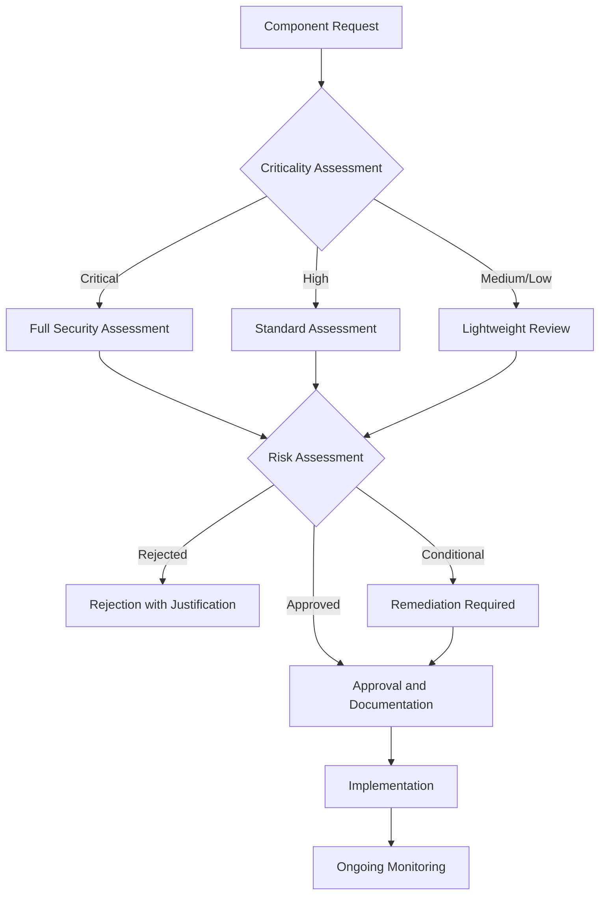

# Third-Party Risk Management Framework

## Executive Summary

This framework establishes comprehensive processes for identifying, assessing, and mitigating risks associated with third-party vendors, suppliers, and technology partners. As organizations increasingly rely on external services and software components, a robust third-party risk management program is essential for maintaining security posture, regulatory compliance, and business continuity.

**Key Objectives:**
- **Supply Chain Security** - Ensure all third-party relationships meet security standards
- **Regulatory Compliance** - Meet SOC 2, ISO 27001, and industry-specific requirements
- **Business Continuity** - Manage third-party dependencies and resilience
- **Risk-Based Decisions** - Enable informed vendor selection and ongoing management

**Target Audience:** Procurement teams, security teams, legal departments, and business units engaging with third parties.

---

## Introduction: The Extended Enterprise Security Challenge

Modern organizations don't operate in isolation. Our security posture extends beyond our own systems to include the security practices of our vendors, suppliers, and technology partners. A single weak link in our supply chain can compromise our entire security program.

This framework provides a structured approach to managing third-party risks throughout the vendor lifecycle, from initial consideration through ongoing relationship management and eventual termination.

## Framework Overview

### Vendor Risk Classification

| Risk Category | Description | Assessment Requirements | Monitoring Frequency |
| :--- | :--- | :--- | :--- |
| **Critical** | Core business functions, sensitive data access | Comprehensive assessment, On-site audit possible | Quarterly |
| **High** | Important business functions, moderate data access | Full assessment, Documentation review | Semi-annually |
| **Medium** | Supporting functions, limited data access | Standard assessment, Self-attestation | Annually |
| **Low** | Minimal business impact, no data access | Lightweight assessment | Biennially |
| **Informational** | No system access, public information only | Basic due diligence | As needed |

### Third-Party Risk Domains

#### 1. Vendor Security Assessment
- Security program evaluation
- Compliance verification
- Technical security controls assessment
- Incident response capabilities review

#### 2. API Security Standards
- API design and implementation security
- Authentication and authorization requirements
- Data protection and privacy considerations
- Monitoring and incident response

#### 3. Supply Chain Risk Assessment
- Component security evaluation
- Build process security
- Distribution integrity verification
- Ongoing vulnerability management

#### 4. Open Source Component Management
- License compliance assessment
- Vulnerability scanning and monitoring
- Component approval workflows
- Maintenance and update processes

## Vendor Security Assessment Process

### Phase 1: Vendor Identification and Classification

#### Initial Vendor Screening

| Step | Action | Owner | Timeline |
| :--- | :--- | :--- | :--- |
| **Vendor Identification** | Business unit identifies potential vendor | Business Unit | Ongoing |
| **Initial Classification** | Security team assigns risk category | Security Team | 2 business days |
| **Pre-Screening Questionnaire** | Basic security and compliance questions | Security Team | 3 business days |
| **Go/No-Go Decision** | Determine if full assessment is required | Security & Business Leadership | 1 business day |

#### Vendor Classification Criteria

**Critical Risk Indicators:**
- Processes, stores, or transmits PII/PHI/financial data
- Provides critical infrastructure or core business functions
- Has access to production systems or source code
- Processes >$1M in transactions annually
- Services >10,000 customers or >1TB of data

**High Risk Indicators:**
- Processes sensitive company information
- Provides supporting business functions
- Has access to non-production systems
- Processes >$100K in transactions annually
- Services >1,000 customers or >100GB of data

### Phase 2: Comprehensive Security Assessment

#### Assessment Questionnaire Structure

**Section 1: Company Information**
- Company overview and history
- Financial stability and insurance coverage
- Legal and regulatory compliance status
- Subprocessor and supply chain information

**Section 2: Security Program**
- Security governance and leadership
- Security policies and procedures
- Employee security training and awareness
- Security incident history and response

**Section 3: Technical Security Controls**
- Network security architecture
- Data encryption and protection
- Access control and identity management
- Vulnerability management and patching

**Section 4: Compliance and Certifications**
- SOC 2, ISO 27001, or other certifications
- Industry-specific compliance (PCI DSS, HIPAA, etc.)
- Privacy program and data protection
- Regulatory audit history

**Section 5: Business Continuity**
- Disaster recovery and business continuity plans
- Backup and recovery procedures
- Service level agreements and performance metrics
- Incident response and communication plans

#### Assessment Scoring Methodology

| Domain | Weight | Scoring Criteria | Maximum Points |
| :--- | :--- | :--- | :--- |
| **Security Program** | 25% | Policy completeness, Training effectiveness | 25 |
| **Technical Controls** | 30% | Control implementation, Monitoring capabilities | 30 |
| **Compliance** | 20% | Certification status, Audit results | 20 |
| **Business Continuity** | 15% | Plan completeness, Testing frequency | 15 |
| **Risk Management** | 10% | Risk assessment processes, Incident history | 10 |
| **Total** | 100% | | **100** |

**Risk Rating Based on Score:**
- **85-100:** Low Risk - Accept with standard monitoring
- **70-84:** Medium Risk - Accept with additional controls
- **50-69:** High Risk - Accept with remediation plan
- **Below 50:** Critical Risk - Not acceptable without major improvements

### Phase 3: Due Diligence and Validation

#### Validation Methods

**Document Review**
- Security policies and procedures
- Certifications and audit reports
- Architecture diagrams and network designs
- Incident response plans and logs

**Technical Testing** (for critical vendors)
- Vulnerability scanning
- Penetration testing
- Configuration review
- API security testing

**Reference Checks**
- Customer references
- Industry reputation research
- Financial stability verification
- Legal and regulatory history review

### Phase 4: Risk Acceptance and Contracting

#### Risk Treatment Options

| Risk Level | Required Actions | Contract Requirements |
| :--- | :--- | :--- |
| **Low** | Standard monitoring | Basic security clauses |
| **Medium** | Additional controls required | Enhanced security clauses, Right to audit |
| **High** | Remediation plan required | Comprehensive security requirements, Penalty clauses |
| **Critical** | Major improvements needed | Custom security requirements, Security SLAs |

#### Standard Security Contract Clauses

**Essential Clauses:**
- Confidentiality and data protection obligations
- Security breach notification requirements
- Right to audit and security assessment rights
- Service level agreements for security
- Data processing agreements
- Incident response and cooperation requirements

**Enhanced Clauses (Medium/High Risk):**
- Specific security control requirements
- Regular security testing obligations
- Security personnel requirements
- Change management notification
- Supply chain security requirements

**Advanced Clauses (Critical Risk):**
- Custom security implementation requirements
- Joint security exercises and testing
- Security investment commitments
- Business continuity testing requirements
- Regulatory cooperation obligations

## API Security Standards

### Third-Party API Security Requirements

#### Authentication and Authorization

| Requirement | Implementation Standard | Testing Requirements |
| :--- | :--- | :--- |
| **API Authentication** | OAuth 2.0 or mTLS required | Test token validation and mTLS setup |
| **Authorization Model** | Scope-based or RBAC required | Test permission enforcement |
| **Rate Limiting** | Rate limits and throttling required | Test rate limit enforcement |
| **API Key Security** | No hardcoded keys, rotation required | Review key management processes |
| **Session Management** | Secure token lifecycle management | Test token expiration and renewal |

#### Data Protection

| Requirement | Implementation Standard | Validation Requirements |
| :--- | :--- | :--- |
| **Data in Transit** | TLS 1.2+ required for all APIs | Certificate validation testing |
| **Data Classification** | PII/PHI clearly identified and protected | Data handling procedure review |
| **Input Validation** | Comprehensive input validation required | Injection testing |
| **Output Filtering** | Sensitive data filtered from responses | Data leakage testing |
| **Logging Security** | No sensitive data in logs | Log review and analysis |

#### API Security Architecture

**Secure Design Principles:**
- Defense in depth with multiple security layers
- Zero-trust architecture for API access
- Micro-segmentation of API services
- Real-time threat detection and response

**Required Security Controls:**
- API gateway with security filtering
- Web Application Firewall (WAF) integration
- API monitoring and anomaly detection
- API versioning and deprecation management
- Security testing in CI/CD pipeline

### API Security Assessment Checklist

#### Pre-Integration Assessment

**Documentation Review:**
- [ ] API documentation includes security considerations
- [ ] Authentication flows clearly documented
- [ ] Rate limits and quotas specified
- [ ] Error handling doesn't expose sensitive information
- [ ] Data classification and handling defined

**Security Implementation:**
- [ ] HTTPS/TLS enforced for all endpoints
- [ ] API authentication properly implemented
- [ ] Authorization controls enforce least privilege
- [ ] Input validation prevents injection attacks
- [ ] Output encoding prevents XSS attacks

**Operational Security:**
- [ ] API keys and secrets properly managed
- [ ] Rate limiting and throttling implemented
- [ ] Monitoring and alerting configured
- [ ] Logging configured without sensitive data
- [ ] Incident response procedures defined

#### Ongoing Monitoring

**Security Monitoring:**
- API access patterns and anomaly detection
- Authentication failure monitoring
- Rate limit breach alerts
- Data access monitoring and auditing
- Third-party dependency monitoring

**Performance Monitoring:**
- API response time and availability
- Error rate monitoring
- Capacity planning and scaling
- Third-party service dependency monitoring

## Supply Chain Risk Assessment

### Software Supply Chain Security

#### Component Security Assessment

| Component Type | Assessment Requirements | Monitoring Frequency |
| :--- | :--- | :--- |
| **Commercial Software** | Vendor security assessment, License review | Annually |
| **Open Source Libraries** | Vulnerability scanning, License compliance | Continuous |
| **Cloud Services** | Cloud security assessment, Compliance verification | Quarterly |
| **Hardware Components** | Supply chain verification, Firmware security | On acquisition |
| **Development Tools** | Security assessment, Access control review | Annually |

#### Build Process Security

**Secure Build Requirements:**
- Code signing and integrity verification
- Dependency vulnerability scanning
- Build environment hardening
- Automated security testing integration
- Artifact provenance tracking

**Supply Chain Integrity:**
- Source code verification and validation
- Third-party component attestation
- Build process reproducibility
- Distribution security and integrity
- Runtime integrity verification

### Third-Party Component Management

#### Component Approval Workflow

#### Component Risk Scoring

| Risk Factor | Weight | Scoring |
| :--- | :--- | :--- |
| **Vulnerability Severity** | 40% | Critical: 0, High: 25, Medium: 50, Low: 75, None: 100 |
| **Component Criticality** | 25% | Critical: 0, High: 25, Medium: 50, Low: 75 |
| **Maintenance Status** | 20% | Active: 100, Maintenance: 50, Deprecated: 0 |
| **License Compatibility** | 10% | Compatible: 100, Review required: 50, Incompatible: 0 |
| **Community Support** | 5% | Strong: 100, Moderate: 75, Limited: 50, None: 25 |

**Overall Risk Score:** Weighted average of all factors
- **80-100:** Low risk - Approved for use
- **60-79:** Medium risk - Approved with monitoring
- **40-59:** High risk - Approved with remediation
- **Below 40:** Critical risk - Not approved

## Open Source Component Management

### Open Source Approval Process

#### Phase 1: Initial Request

**Request Requirements:**
- Business justification for component usage
- Technical requirements and alternatives considered
- Preliminary security assessment
- License compatibility review
- Maintenance and support plan

**Request Documentation:**
- Component name and version
- Source repository and official documentation
- Intended use case and integration points
- Security and compliance requirements
- Long-term maintenance strategy

#### Phase 2: Security Assessment

**Automated Analysis:**
- Vulnerability database lookup (CVE, NVD)
- Malware and backdoor scanning
- Code quality and maintainability analysis
- Dependency chain analysis
- License compliance checking

**Manual Review:**
- Code review for critical components
- Security best practices evaluation
- Community health assessment
- Update frequency and response time analysis
- Security advisory track record

#### Phase 3: Approval Decision

**Approval Criteria:**
- No critical or high vulnerabilities
- Compatible license for intended use
- Active maintenance and community support
- Acceptable security track record
- Clear update and patching process

**Conditional Approval:**
- Medium vulnerabilities with remediation timeline
- License compatibility issues with legal review
- Limited usage scope with additional controls
- Additional monitoring and reporting requirements
- Time-limited approval with re-evaluation

#### Phase 4: Ongoing Management

**Monitoring Requirements:**
- Continuous vulnerability scanning
- Security advisory monitoring
- License compliance tracking
- Usage monitoring and reporting
- Performance and stability monitoring

**Update Management:**
- Automated dependency updates where possible
- Security patch deployment procedures
- Version compatibility testing
- Rollback planning and testing
- Communication and change management

### License Compliance Management

#### License Classification

| License Category | Risk Level | Usage Restrictions | Approval Requirements |
| :--- | :--- | :--- | :--- |
| **Permissive** (MIT, Apache 2.0) | Low | Minimal restrictions | Standard approval |
| **Weak Copyleft** (LGPL, MPL) | Medium | Source code disclosure | Legal review required |
| **Strong Copyleft** (GPL) | High | Source code disclosure | Legal + Security approval |
| **Proprietary** | Variable | License terms apply | Full legal review |
| **Unknown** | High | Requires investigation | Full legal + security review |

#### Compliance Workflow

1. **License Identification** - Automatic license detection
2. **Risk Assessment** - Compliance and security risk evaluation
3. **Legal Review** - Legal team assessment for restrictive licenses
4. **Approval Decision** - Final approval with usage conditions
5. **Usage Tracking** - Monitor component usage and compliance
6. **Ongoing Monitoring** - Track license changes and updates

## Implementation Roadmap

### Phase 1: Foundation (Months 1-3)

**Month 1: Program Setup**
- [ ] Third-party risk management team charter
- [ ] Risk classification framework definition
- [ ] Initial vendor questionnaire development
- [ ] Assessment tools and platform selection

**Month 2: Process Development**
- [ ] Vendor assessment workflow definition
- [ ] Contract security clause library
- [ ] API security standards development
- [ ] Component approval process design

**Month 3: Pilot Implementation**
- [ ] Select pilot vendors for assessment
- [ ] Conduct initial vendor assessments
- [ ] Test assessment tools and processes
- [ ] Refine processes based on pilot feedback

### Phase 2: Expansion (Months 4-6)

**Month 4: Program Expansion**
- [ ] Roll out to all critical vendors
- [ ] Implement automated assessment tools
- [ ] Develop API security assessment checklist
- [ ] Create open source component database

**Month 5: Automation Integration**
- [ ] Integrate with procurement systems
- [ ] Implement continuous monitoring
- [ ] Develop vendor risk dashboard
- [ ] Create automated alerting systems

**Month 6: Advanced Features**
- [ ] Implement predictive risk modeling
- [ ] Develop vendor performance metrics
- [ ] Create executive reporting dashboard
- [ ] Establish vendor review board

### Phase 3: Optimization (Months 7-12)

**Months 7-9: Program Maturation**
- [ ] Expand to all vendor categories
- [ ] Implement advanced analytics
- [ ] Develop vendor improvement programs
- [ ] Create industry benchmarking

**Months 10-12: Continuous Improvement**
- [ ] Program effectiveness measurement
- [ ] Process optimization based on metrics
- [ ] Industry best practice integration
- [ ] Program scaling and automation

## Tools and Technologies

### Vendor Risk Assessment Platforms

| Tool | Features | Integration | Pricing Model |
| :--- | :--- | :--- | :--- |
| **OneTrust** | Comprehensive VRM, Questionnaires, Assessments | Procurement, GRC systems | Enterprise licensing |
| **ProcessUnity** | VRM, GRC, Risk management | ERP systems, Procurement | Enterprise licensing |
| **Whistic** | Vendor assessments, Questionnaires | Slack, Teams, Email | Per-user licensing |
| **SecurityScorecard** | Continuous monitoring, Risk ratings | SIEM, GRC systems | Subscription-based |

### API Security Tools

| Tool | Features | Integration | Use Case |
| :--- | :--- | :--- | :--- |
| **OWASP ZAP** | API security testing, Vulnerability scanning | CI/CD pipelines | Automated testing |
| **Postman** | API testing, Security validation | Development workflows | Manual testing |
| **Insomnia** | API development, Security testing | Development workflows | Manual testing |
| **Burp Suite** | Web application security, API testing | Development, QA | Comprehensive testing |

### Supply Chain Security Tools

| Tool | Features | Integration | Purpose |
| :--- | :--- | :--- | :--- |
| **Snyk** | Dependency scanning, License checking | CI/CD, IDE | Open source security |
| **OWASP Dependency-Check** | Vulnerability scanning | Build tools | Dependency analysis |
| **GitHub Dependabot** | Automated dependency updates | GitHub repositories | Continuous monitoring |
| **WhiteSource** | License compliance, Vulnerability scanning | Multiple platforms | Comprehensive management |

## Metrics and Monitoring

### Vendor Risk Metrics

| Metric | Target | Measurement Method |
| :--- | :--- | :--- |
| **Vendor Assessment Coverage** | 100% of critical vendors | Assessment tracking |
| **Risk Mitigation Effectiveness** | 90% of identified risks mitigated | Risk tracking system |
| **Assessment Timeliness** | 90% completed within SLA | Assessment timestamp analysis |
| **Vendor Compliance Rate** | 95% compliance with requirements | Compliance monitoring |
| **Vendor Security Incidents** | < 5% of vendors per year | Incident tracking |

### API Security Metrics

| Metric | Target | Measurement Method |
| :--- | :--- | :--- |
| **API Security Assessment Coverage** | 100% of third-party APIs | Assessment tracking |
| **API Vulnerability Detection** | 90% discovered in testing | Vulnerability tracking |
| **API Response Time** | < 500ms average | Performance monitoring |
| **API Authentication Success Rate** | > 99% | Authentication monitoring |
| **API Security Incident Rate** | < 1% of total incidents | Incident tracking |

### Supply Chain Metrics

| Metric | Target | Measurement Method |
| :--- | :--- | :--- |
| **Component Vulnerability Remediation** | 90% within 30 days | Vulnerability tracking |
| **Open Source License Compliance** | 100% compliance | Compliance monitoring |
| **Component Assessment Coverage** | 100% of components | Assessment tracking |
| **Supply Chain Security Incidents** | < 2% of total incidents | Incident tracking |
| **Component Update Frequency** | Quarterly for critical components | Update tracking |

## Governance and Maintenance

### Program Governance

| Role | Responsibilities | Authority |
| :--- | :--- | :--- |
| **Third-Party Risk Manager** | Program oversight, Risk assessment methodology | Program decisions, Risk ratings |
| **Vendor Assessment Team** | Conduct assessments, Monitor vendor performance | Assessment execution, Recommendations |
| **API Security Lead** | API security standards, Assessment execution | API security requirements, Approvals |
| **Supply Chain Security Engineer** | Component security, Supply chain monitoring | Component approvals, Security requirements |
| **Legal Counsel** | Contract review, License compliance | Legal requirements, Contract approval |
| **Procurement Manager** | Vendor selection, Contract negotiation | Vendor relationships, Commercial terms |

### Maintenance Processes

| Activity | Frequency | Owner | Process |
| :--- | :--- | :--- | :--- |
| **Vendor Risk Reassessment** | Annual (Critical: Quarterly) | Risk Management Team | Full assessment update |
| **API Security Review** | Semi-annual | API Security Lead | Security standard updates |
| **Component Security Review** | Quarterly | Supply Chain Team | Vulnerability assessment update |
| **Framework Review** | Annual | Program Manager | Framework updates and improvements |
| **Metrics Review** | Monthly | All Teams | Performance analysis and optimization |

## Related Documents

- [Security Training & Culture Program](../10.%20Security%20Training%20&%20Culture/Security%20Training%20&%20Culture%20Program.md)
- [Secure Infrastructure Standard](../1.%20Developer%20Documentation/Infrastructure/Secure%20Infrastructure%20Standard.md)
- [API Security Standard](../1.%20Developer%20Documentation/API%20Security%20Standard.md)
- [Data Security & Privacy Standard](../1.%20Developer%20Documentation/Data%20Security%20&%20Privacy%20Standard.md)
- [Incident Response Plan](../8.%20Incident%20Response/README.md)

## Review and Maintenance

This document should be reviewed quarterly and updated as follows:
- **Monthly:** Vendor risk monitoring and assessment updates
- **Quarterly:** Comprehensive framework review and metrics analysis
- **Annually:** Strategic program alignment and regulatory compliance updates

Document Owner: Third-Party Risk Management Team
Last Updated: [Current Date]
Next Review Date: [Quarterly Schedule]

---

**Appendix A: Vendor Security Assessment Questionnaire**

[Comprehensive questionnaire template covering all security domains]

**Appendix B: API Security Assessment Checklist**

[Detailed checklist for API security evaluation]

**Appendix C: Component Approval Request Form**

[Standardized form for requesting new component approval]

**Appendix D: Risk Assessment Scoring Matrix**

[Detailed scoring methodology and risk calculation examples]

**Appendix E: Contract Security Clause Library**

[Collection of standard and specialized security contract clauses]