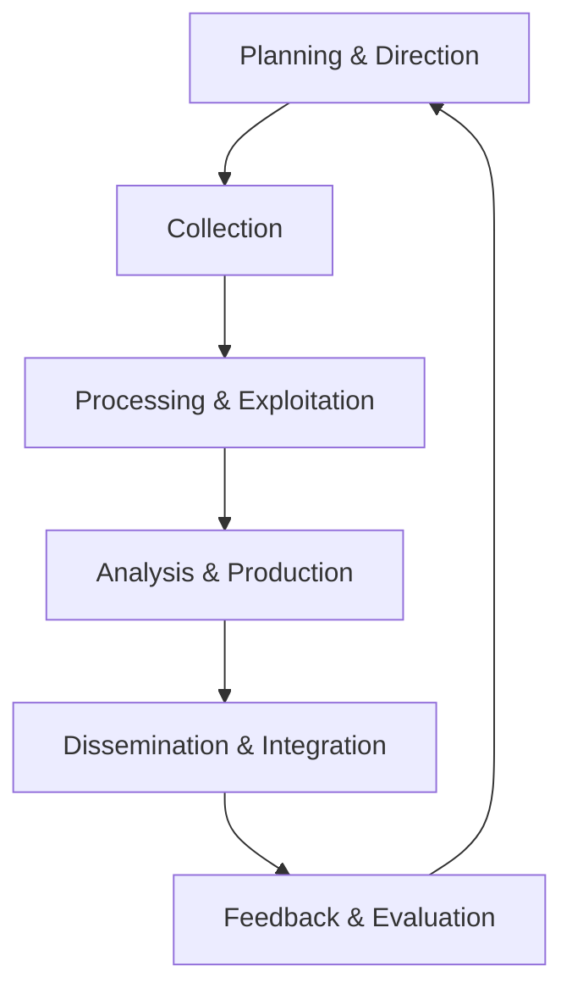
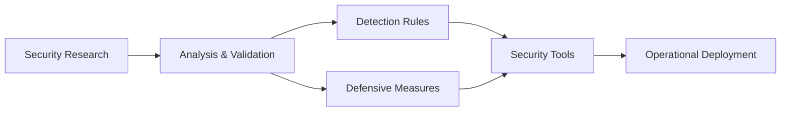

# Advanced Threat Intelligence Program

## Executive Summary

This program establishes a comprehensive threat intelligence capability that transforms raw security data into actionable insights, enabling proactive defense against emerging threats. By integrating external threat intelligence, internal security research, and industry collaboration, we can anticipate, detect, and respond to threats before they impact our organization.

**Key Objectives:**
- **Proactive Threat Defense** - Identify and mitigate threats before they cause harm
- **Strategic Security Planning** - Inform security strategy based on emerging threats
- **Rapid Incident Response** - Leverage intelligence for faster threat containment
- **Industry Collaboration** - Participate in threat sharing and collective defense

**Target Audience:** Security Operations Center (SOC), Incident Response teams, Security Leadership, and Development teams.

---

## Introduction: From Reactive to Proactive Security

While we have established excellent reactive security capabilities through our incident response program, automated security controls, and comprehensive monitoring, the next evolution is developing proactive threat intelligence capabilities. This program enables us to anticipate threats, understand adversary tactics, and implement defensive measures before attacks occur.

## Threat Intelligence Framework

### Intelligence Types

| Intelligence Type | Time Horizon | Sources | Primary Consumers | Use Cases |
| :--- | :--- | :--- | :--- | :--- |
| **Strategic Intelligence** | 6-18 months | Industry reports, Government alerts | Leadership, Planning | Budget allocation, Strategy planning |
| **Tactical Intelligence** | 1-6 months | Threat actor reports, Malware analysis | Security Teams, Engineers | Tool selection, Architecture decisions |
| **Operational Intelligence** | 1-30 days | Vulnerability disclosures, Attack campaigns | SOC, Incident Response | Rule tuning, Alert configuration |
| **Technical Intelligence** | Real-time-24 hours | IOC feeds, Dark web monitoring | SOC, Automated Systems | Blocklists, Detection rules |

### Intelligence Lifecycle



## Threat Intelligence Integration Processes

### 1. Intelligence Collection Pipeline

#### External Intelligence Sources

**Commercial Threat Intelligence Feeds:**
- **CrowdStrike Falcon Intelligence** - Real-time threat actor and campaign data
- **Recorded Future** - Predictive intelligence and risk scoring
- **Mandiant Threat Intelligence** - Advanced threat actor research and indicators
- **Palo Alto Unit 42** - Comprehensive threat research and IOC feeds
- **Anomali ThreatStream** - Community-driven threat intelligence platform

**Open Source Intelligence (OSINT):**
- **VirusTotal** - Malware analysis and URL/file reputation
- **Abuse.ch** - Malware domain and URL blocklists
- **PhishTank** - Phishing URL community database
- **AlienVault OTX** - Open threat intelligence platform
- **MISP** - Malware Information Sharing Platform

**Government and Industry Sources:**
- **CISA Alerts** - Cybersecurity and Infrastructure Security Agency alerts
- **US-CERT** - United States Computer Emergency Readiness Team
- **ENISA** - European Union Agency for Cybersecurity
- **ISACs** - Information Sharing and Analysis Centers
- **FIRST** - Forum of Incident Response and Security Teams

#### Internal Intelligence Sources

**Security Tool Data:**
- **SIEM alerts** - Security incident and event management data
- **EDR data** - Endpoint detection and response telemetry
- **Network traffic analysis** - NetFlow, DNS, and packet capture data
- **Vulnerability scan results** - Internal and external vulnerability assessments
- **Application security data** - SAST/DAST results, security test findings

**Business Context Data:**
- **Asset inventory** - Critical systems and data classification
- **Business processes** - Critical workflows and dependencies
- **Third-party relationships** - Vendor and partner security posture
- **Regulatory requirements** - Compliance obligations and audit findings
- **Risk assessments** - Existing risk analysis and mitigation plans

### 2. Intelligence Processing and Analysis

#### Data Processing Pipeline

**Ingestion Stage:**
- **Automated feed collection** - API-based data collection from all sources
- **Data normalization** - Standardize format across different intelligence sources
- **Duplicate removal** - Eliminate redundant intelligence items
- **Data validation** - Verify accuracy and reliability of intelligence data
- **Enrichment** - Add context and metadata to raw intelligence

**Processing Stage:**
- **IOC extraction** - Identify and extract indicators of compromise
- **Threat classification** - Categorize threats by type, severity, and relevance
- **Attribution analysis** - Identify threat actors and attack patterns
- **TTP mapping** - Map to MITRE ATT&CK framework
- **Risk scoring** - Assess potential impact and likelihood

#### Analysis Framework

**Strategic Analysis:**
- Threat landscape trends and evolution
- Emerging attack techniques and technologies
- Industry-specific threat patterns
- Geopolitical threat implications
- Regulatory and compliance impact

**Tactical Analysis:**
- Attack campaign analysis and tracking
- Malware family evolution and capabilities
- Vulnerability exploitation trends
- Infrastructure and tooling analysis
- Defense evasion techniques

**Operational Analysis:**
- Active threat monitoring and tracking
- IOC validation and false positive analysis
- Attack pattern recognition and correlation
- Incident response support and guidance
- Defensive countermeasure development

### 3. Intelligence Dissemination

#### Dissemination Channels

**Strategic Reports:**
- **Monthly Threat Landscape Report** - Executive-level overview
- **Quarterly Threat Forecast** - Predictive analysis and recommendations
- **Annual Threat Intelligence Report** - Comprehensive year in review
- **Ad-Hoc Threat Advisories** - Time-sensitive threat information

**Tactical Briefings:**
- **Weekly Threat Intelligence Brief** - Operational teams update
- **Threat Actor Profiles** - Detailed adversary analysis
- **Malware Analysis Reports** - Technical malware behavior analysis
- **Vulnerability Intelligence** - Emerging vulnerability assessments

**Operational Alerts:**
- **Real-time IOC Alerts** - Immediate threat indicator distribution
- **Campaign Warnings** - Active attack campaign notifications
- **Zero-Day Vulnerability Alerts** - Critical vulnerability notifications
- **Security Control Recommendations** - Defensive measure guidance

#### Integration Points

**Security Tool Integration:**
- **SIEM Integration** - Automated IOC rule creation and alerting
- **EDR Integration** - Threat behavioral detection rules
- **Firewall Integration** - Automatic IP and domain blocking
- **Email Security Integration** - Phishing URL and attachment blocking
- **Web Gateway Integration** - Malicious URL categorization and blocking

**Tool Integration Automation:**
```yaml
# Example automation workflow
name: "Threat Intelligence Integration"
trigger:
  - threat_intelligence_feed_update
steps:
  - name: "Extract IOCs"
    action: extract_indicators
    source: intelligence_feed

  - name: "Validate IOCs"
    action: validate_indicators
    filters:
      - remove_false_positives
      - verify_relevance

  - name: "Update Security Controls"
    action: update_controls
    targets:
      - siem_rules
      - firewall_blocklists
      - edr_detection_rules
      - email_security_filters

  - name: "Generate Alert"
    action: create_alert
    severity: calculate_risk_score
    channels:
      - soc_dashboard
      - security_team_slack
      - email_notifications
```

## Security Research Integration

### 1. Internal Security Research Program

#### Research Areas

**Vulnerability Research:**
- **Zero-day vulnerability discovery** - Research in target systems and applications
- **Vulnerability analysis** - Deep technical analysis of discovered vulnerabilities
- **Exploitation research** - Proof-of-concept exploit development
- **Patch analysis** - Security patch effectiveness evaluation
- **Vulnerability coordination** - Responsible disclosure with vendors

**Malware Research:**
- **Malware reverse engineering** - Technical analysis of malicious code
- **Behavior analysis** - Dynamic analysis of malware behavior
- **Communication protocols** - C2 and data exfiltration analysis
- **Persistence mechanisms** - Malware installation and survival techniques
- **Anti-analysis techniques** - Malware evasion and detection avoidance

**Attack Technique Research:**
- **Attack methodology analysis** - Study of attack patterns and techniques
- **Defense evasion research** - Analysis of bypass techniques
- **Lateral movement research** - Internal network propagation techniques
- **Data exfiltration methods** - Techniques for data theft
- **Anti-forensics research** - Attack methods to avoid detection

#### Research Process

**Research Planning:**
- **Threat landscape analysis** - Identify research priorities
- **Capability assessment** - Evaluate research resources and skills
- **Legal and ethical review** - Ensure compliance with laws and regulations
- **Risk assessment** - Evaluate risks associated with research activities
- **Resource allocation** - Assign research projects and timelines

**Research Execution:**
- **Environment setup** - Create secure research environments
- **Sample acquisition** - Obtain malware samples and systems for testing
- **Analysis execution** - Conduct technical research and analysis
- **Documentation** - Document findings and methodologies
- **Validation** - Verify research results and conclusions

**Research Dissemination:**
- **Internal reporting** - Share findings with security teams
- **External publication** - Contribute to security community knowledge
- **Vendor coordination** - Coordinate vulnerability disclosure with affected parties
- **Conference presentations** - Share research at security conferences
- **Blog posts and articles** - Publish educational content

### 2. Research Integration with Operations

#### Research-to-Operations Pipeline



**Integration Process:**
1. **Research Findings** - Internal security research discoveries
2. **Analysis** - Technical analysis and validation of findings
3. **Operationalization** - Convert research into defensive measures
4. **Deployment** - Implement new security controls and detection rules
5. **Monitoring** - Track effectiveness of research-based defenses
6. **Feedback** - Provide operational feedback to guide future research

**Research Output Types:**
- **Detection Rules** - Snort, YARA, Sigma, and custom detection signatures
- **Security Tool Configurations** - Tool-specific configurations and policies
- **Incident Response Playbooks** - Procedures for handling new threat types
- **Security Architecture Recommendations** - Design improvements for new threats
- **Training Materials** - Educational content for security awareness

## Emerging Threat Monitoring Procedures

### 1. Threat Landscape Monitoring

#### Continuous Monitoring Activities

**Dark Web Monitoring:**
- **Marketplace monitoring** - Track stolen data, credentials, and tools for sale
- **Forum monitoring** - Monitor hacking forums for attack planning and discussions
- **Communication channels** - Monitor Telegram, Discord, and other platforms
- **Threat actor communications** - Track threat group communications and announcements
- **Recruitment activities** - Monitor threat actor recruitment and hiring

**Social Media Monitoring:**
- **Hacktivist groups** - Monitor hacktivist activities and campaigns
- **Threat actor announcements** - Track official statements and claims
- **Attack claims** - Monitor claims of responsibility for attacks
- **Tool and technique sharing** - Track sharing of attack methods and tools
- **Community discussions** - Monitor security community discussions

**Technical Monitoring:**
- **Malware distribution** - Monitor malware distribution channels and methods
- **Command and control** - Track C2 infrastructure and communication
- **Vulnerability markets** - Monitor zero-day vulnerability trading
- **Exploit kits** - Track exploit kit development and distribution
- **Tool development** - Monitor new attack tools and techniques

#### Monitoring Tools and Platforms

**Threat Intelligence Platforms:**
- **MISP** - Malware Information Sharing Platform and Threat Sharing
- **TheHive** - Scalable, Open Source and Free Security Incident Response Platform
- **Cortex** - Powerful Observable Analysis and Active Response Engine
- **OpenCTI** - Open Cyber Threat Intelligence Platform
- **Yeti** - Your Everyday Threat Intelligence

**Monitoring Automation:**
```python
# Example dark web monitoring automation
import requests
import logging
from datetime import datetime

class DarkWebMonitor:
    def __init__(self):
        self.sources = [
            'dark_web_marketplace_1',
            'hacking_forum_1',
            'telegram_channel_1'
        ]
        self.alert_thresholds = {
            'company_mentioned': 1,
            'industry_mentioned': 3,
            'vulnerability_mentioned': 2
        }

    def monitor_sources(self):
        """Monitor all configured sources for threat intelligence"""
        for source in self.sources:
            try:
                data = self.collect_data(source)
                threats = self.analyze_data(data)
                if threats:
                    self.generate_alerts(threats, source)
            except Exception as e:
                logging.error(f"Error monitoring {source}: {e}")

    def analyze_data(self, data):
        """Analyze collected data for threat indicators"""
        threats = []
        keywords = self.get_company_keywords()

        for item in data:
            if self.contains_keywords(item, keywords):
                threats.append({
                    'source': source,
                    'content': item,
                    'severity': self.calculate_severity(item),
                    'timestamp': datetime.now()
                })

        return threats

    def generate_alerts(self, threats, source):
        """Generate security alerts for identified threats"""
        for threat in threats:
            if threat['severity'] >= 3:  # High severity threshold
                self.send_alert({
                    'title': f"Dark Web Threat Detected - {source}",
                    'description': threat['content'],
                    'severity': threat['severity'],
                    'source': source,
                    'timestamp': threat['timestamp']
                })
```

### 2. Emerging Technology Threat Monitoring

#### Technology-Specific Monitoring

**Cloud Security Threats:**
- **Cloud service misconfigurations** - Monitor for new cloud attack techniques
- **Container threats** - Track container-specific attacks and vulnerabilities
- **Serverless threats** - Monitor serverless architecture attack methods
- **API threats** - Track API security vulnerabilities and attacks
- **Multi-cloud threats** - Monitor threats across cloud environments

**AI/ML Security Threats:**
- **Model poisoning attacks** - Monitor ML model manipulation techniques
- **Adversarial attacks** - Track adversarial ML attack methods
- **Data poisoning** - Monitor training data corruption techniques
- **Model extraction** - Track ML model reverse engineering attempts
- **Privacy attacks** - Monitor ML privacy violation techniques

**IoT/OT Security Threats:**
- **Device vulnerabilities** - Monitor IoT device security flaws
- **Network threats** - Track IoT network attack methods
- **Supply chain attacks** - Monitor IoT supply chain security issues
- **Firmware threats** - Track firmware-based attack techniques
- **Protocol attacks** - Monitor IoT protocol vulnerabilities

#### Emerging Threat Indicators

**Early Warning Indicators:**
- **New vulnerability disclosures** - Monitor newly discovered vulnerabilities
- **Exploit development** - Track exploit code availability
- **Attack tool development** - Monitor new attack tool releases
- **Threat actor recruitment** - Track threat actor hiring and expansion
- **Campaign planning** - Monitor attack campaign preparation activities

**Monitoring Automation:**
```yaml
# Example emerging threat monitoring workflow
name: "Emerging Threat Detection"
trigger:
  - scheduled:
      interval: "1h"

steps:
  - name: "Collect Emerging Threats"
    action: collect_intelligence
    sources:
      - vuln_disclosures
      - exploit_databases
      - dark_web_forums
      - social_media

  - name: "Analyze Threat Relevance"
    action: analyze_relevance
    criteria:
      - company_size_match
      - industry_relevance
      - technology_stack_match
      - geographic_relevance

  - name: "Assess Threat Impact"
    action: assess_impact
    factors:
      - vulnerability_severity
      - exploit_maturity
      - threat_actor_capability
      - asset_exposure

  - name: "Generate Early Warning"
    action: create_alert
    condition: impact_score > 7
    channels:
      - security_team_slack
      - email_alerts
      - dashboard_notifications

  - name: "Update Defensive Measures"
    action: update_defenses
    measures:
      - detection_rules
      - blocking_rules
      - monitoring_rules
      - prevention_controls
```

## Industry Threat Sharing Participation

### 1. Information Sharing and Analysis Centers (ISACs)

#### ISAC Participation Strategy

**Financial Services ISAC (FS-ISAC):**
- **Membership Level** - Full membership for comprehensive threat intelligence
- **Participation Areas** - Banking, payments, fintech threat sharing
- **Sharing Protocols** - Real-time threat indicator sharing
- **Collaboration** - Joint analysis and incident response

**Health Information Sharing and Analysis Center (H-ISAC):**
- **Membership Level** - Active participation in healthcare threats
- **Participation Areas** - Medical devices, healthcare data, PHI protection
- **Sharing Protocols** - Healthcare-specific threat indicators
- **Collaboration** - Healthcare security incident response

**Technology ISAC:**
- **Membership Level** - Participation in technology sector threats
- **Participation Areas** - Software, cloud services, technology platforms
- **Sharing Protocols** - Technology vulnerability and attack sharing
- **Collaboration** - Technology security best practices

#### ISAC Integration Process

**Membership Onboarding:**
1. **Application Process** - Formal ISAC membership application
2. **Background Check** - Security clearance verification
3. **Training Requirements** - ISAC-specific training and certification
4. **Tool Setup** - ISAC communication and sharing tools
5. **Protocol Training** - Information sharing protocols and procedures

**Participation Activities:**
- **Threat Intelligence Sharing** - Share relevant threat indicators
- **Incident Reporting** - Report security incidents to ISAC
- **Analysis Collaboration** - Participate in joint analysis activities
- **Best Practice Sharing** - Share security approaches and lessons learned
- **Working Groups** - Participate in ISAC working groups and committees

### 2. Threat Sharing Communities

#### Open Source Security Communities

**MISP Communities:**
- **Community Membership** - Join relevant MISP communities
- **Information Sharing** - Share threat intelligence with community members
- **Collaboration** - Participate in community analysis activities
- **Tool Development** - Contribute to MISP platform development

**FIRST (Forum of Incident Response and Security Teams):**
- **Organization Membership** - Full membership for incident response collaboration
- **Conference Participation** - Attend FIRST conferences and workshops
- **Working Groups** - Participate in FIRST working groups
- **Knowledge Sharing** - Share incident response experiences and practices

**OWASP (Open Web Application Security Project):**
- **Chapter Participation** - Local OWASP chapter involvement
- **Project Contribution** - Contribute to OWASP projects and tools
- **Conference Participation** - Attend and present at OWASP conferences
- **Research Collaboration** - Participate in OWASP research projects

#### Industry-Specific Communities

**Security Research Communities:**
- **DEF CON Groups** - Local DEF CON group participation
- **OWASP Chapters** - Local OWASP chapter involvement
- **BSides Communities** - BSides conference organization and participation
- **Local Security Meetups** - Community security meetups and events

**Vendor Communities:**
- **User Groups** - Security tool user group participation
- **Beta Programs** - Participation in vendor beta testing programs
- **Advisory Boards** - Security vendor advisory board participation
- **Research Partnerships** - Joint research with security vendors

### 3. Threat Sharing Integration

#### Sharing Automation

**Automated Sharing Platforms:**
```python
# Example threat sharing automation
import json
import requests
from datetime import datetime

class ThreatSharingManager:
    def __init__(self):
        self.sharing_platforms = {
            'misp': 'https://misp.example.com',
            'isac_api': 'https://isac.example.com/api',
            'first_platform': 'https://first.example.com'
        }
        self.sharing_rules = {
            'auto_share_critical': True,
            'share_anonymized': True,
            'min_confidence': 70,
            'share_delay_hours': 24
        }

    def share_threat_intelligence(self, intelligence):
        """Share threat intelligence with appropriate platforms"""
        validated_intel = self.validate_intelligence(intelligence)

        for platform in self.sharing_platforms:
            if self.should_share(validated_intel, platform):
                try:
                    self.share_to_platform(validated_intel, platform)
                    self.log_sharing_activity(validated_intel, platform)
                except Exception as e:
                    self.handle_sharing_error(e, platform, validated_intel)

    def validate_intelligence(self, intelligence):
        """Validate and prepare intelligence for sharing"""
        return {
            'title': intelligence.get('title'),
            'description': intelligence.get('description'),
            'iocs': self.extract_iocs(intelligence),
            'confidence': intelligence.get('confidence'),
            'severity': intelligence.get('severity'),
            'tags': intelligence.get('tags', []),
            'source': intelligence.get('source'),
            'timestamp': datetime.now().isoformat()
        }

    def should_share(self, intelligence, platform):
        """Determine if intelligence should be shared with platform"""
        rules = self.sharing_platforms[platform]

        if intelligence['confidence'] < self.sharing_rules['min_confidence']:
            return False

        if intelligence['severity'] == 'critical' and self.sharing_rules['auto_share_critical']:
            return True

        return intelligence.get('share_permission', False)
```

**Sharing Governance:**
- **Classification Review** - Ensure appropriate data classification before sharing
- **Anonymization** - Remove sensitive information before sharing
- **Approval Process** - Review and approve sharing activities
- **Documentation** - Document all sharing activities and decisions
- **Audit Trail** - Maintain audit trail of all sharing activities

## Implementation Roadmap

### Phase 1: Foundation (Months 1-3)

**Month 1: Program Setup**
- [ ] Threat intelligence team charter and roles
- [ ] Intelligence requirements definition
- [ ] Threat intelligence platform selection
- [ ] Initial threat intelligence source setup

**Month 2: Collection Integration**
- [ ] External threat intelligence feed integration
- [ ] Internal security tool data collection
- [ ] Data normalization and processing pipeline
- [ ] Initial analysis and reporting setup

**Month 3: Analysis Capability**
- [ ] Threat intelligence analysis framework
- [ ] IOC extraction and management
- [ ] MITRE ATT&CK mapping process
- [ ] Initial threat intelligence reports

### Phase 2: Expansion (Months 4-6)

**Month 4: Research Integration**
- [ ] Internal security research program launch
- [ ] Research-to-operations pipeline development
- [ ] Research tooling and environment setup
- [ ] Initial research projects initiation

**Month 5: Monitoring Enhancement**
- [ ] Emerging threat monitoring setup
- [ ] Dark web and social media monitoring
- [ ] Automated threat detection systems
- [ ] Alerting and notification systems

**Month 6: Community Participation**
- [ ] ISAC membership applications
- [ ] Community participation strategy
- [ ] Sharing platform setup
- [ ] Initial community participation activities

### Phase 3: Advanced Capabilities (Months 7-12)

**Months 7-9: Advanced Analytics**
- [ ] Predictive threat intelligence capabilities
- [ ] Machine learning threat analysis
- [ ] Advanced threat actor tracking
- [ ] Custom threat intelligence research

**Months 10-12: Program Optimization**
- [ ] Program effectiveness measurement
- [ ] Threat intelligence metrics implementation
- [ ] Continuous improvement processes
- [ ] Strategic planning and evolution

## Tools and Technologies

### Threat Intelligence Platforms

| Platform | Features | Integration | Pricing |
| :--- | :--- | :--- | :--- |
| **MISP** | Open source threat sharing, IOC management | SIEM, SOAR, Custom APIs | Free/Open source |
| **TheHive** | Incident response, Case management | MISP, Cortex, SIEM | Free/Open source |
| **Cortex** | Observable analysis, Security tools | TheHive, MISP, Custom | Free/Open source |
| **Recorded Future** | Predictive intelligence, Risk scoring | SIEM, SOAR, Threat feeds | Enterprise licensing |
| **CrowdStrike Falcon** | Threat actor intelligence, Endpoint data | EDR, SIEM, Custom APIs | Subscription-based |

### Collection and Analysis Tools

| Tool Category | Examples | Use Cases | Integration |
| :--- | :--- | :--- | :--- |
| **Dark Web Monitoring** | Flashpoint, ZeroFox, DarkOwl | Threat actor monitoring, Data breach detection | Alert systems, SIEM |
| **Social Media Monitoring** | Brandwatch, Talkwalker, Meltwater | Threat actor tracking, Attack claims | Alert systems, Intel platforms |
| **Vulnerability Intelligence** | VulnDB, CVE Details, Risk Based Security | Vulnerability tracking, Exploit monitoring | Vulnerability management, SIEM |
| **Malware Analysis** | VirusTotal, Hybrid Analysis, ANY.RUN | Malware analysis, IOC extraction | Threat intel platforms, EDR |
| **Threat Actor Tracking** | ThreatConnect, Intel 471, Mandiant | Threat actor monitoring, Campaign tracking | Threat intel platforms, SIEM |

## Metrics and Success Factors

### Program Effectiveness Metrics

| Metric | Target | Measurement Method |
| :--- | :--- | :--- |
| **Threat Intelligence Coverage** | 90% of relevant threats detected | Threat coverage analysis |
| **Early Warning Accuracy** | 85% accurate early warnings | Prediction accuracy tracking |
| **Threat Detection Improvement** | 40% faster threat detection | Detection time analysis |
| **False Positive Rate** | < 10% false positive rate | Alert analysis |
| **Intelligence Utilization** | 80% of intelligence used operationally | Usage tracking |

### Research Impact Metrics

| Metric | Target | Measurement Method |
| :--- | :--- | :--- |
| **Research Output Quality** | 75% of research results implemented | Implementation tracking |
| **Vulnerability Discovery** | 5 significant discoveries annually | Research output analysis |
| **Detection Rule Effectiveness** | 30% improvement in detection rates | Detection metrics |
| **Conference Presentations** | 3 conference presentations annually | Activity tracking |
| **Community Contributions** | 10 significant contributions annually | Community impact tracking |

### Community Participation Metrics

| Metric | Target | Measurement Method |
| :--- | :--- | :--- |
| **ISAC Engagement** | Active participation in 2 ISACs | Participation tracking |
| **Information Sharing** | Share 50 intelligence items annually | Sharing logs |
| **Community Contributions** | 20 contributions to communities | Contribution tracking |
| **Industry Recognition** | 2 industry recognitions annually | Recognition tracking |
| **Collaboration Projects** | 3 joint projects annually | Project tracking |

## Governance and Management

### Program Governance

| Role | Responsibilities | Authority |
| :--- | :--- | :--- |
| **Threat Intelligence Manager** | Program oversight, Strategy development | Budget decisions, Strategy approval |
| **Intelligence Analysts** | Threat analysis, Research, Reporting | Analysis methods, Content approval |
| **Security Researchers** | Vulnerability research, Malware analysis | Research direction, Publication approval |
| **Community Liaison** | ISAC participation, Community engagement | Sharing decisions, Community representation |
| **Technical Integration Lead** | Tool integration, Automation | Platform decisions, Integration approval |

### Management Processes

| Activity | Frequency | Owner | Process |
| :--- | :--- | :--- | :--- |
| **Strategic Planning** | Quarterly | Program Manager | Strategy development and review |
| **Operational Review** | Weekly | Team Lead | Operational activities review |
| **Research Planning** | Monthly | Research Lead | Research project planning |
| **Community Engagement** | Ongoing | Community Liaison | Participation and sharing activities |
| **Performance Review** | Monthly | All Team Members | Individual and team performance |

## Related Documents

- [Security Training & Culture Program](../10.%20Security%20Training%20&%20Culture/Security%20Training%20&%20Culture%20Program.md)
- [Incident Response Plan](../8.%20Incident%20Response/README.md)
- [Secure Infrastructure Standard](../1.%20Developer%20Documentation/Infrastructure/Secure%20Infrastructure%20Standard.md)
- [Application Security Compliance Checklist](../3.%20Application%20Coding%20Checklist/Application%20Security%20Compliance%20Checklist.md)
- [Secure CI/CD Pipeline](../2.%20CICD%20Checklist/Secure%20CI-CD%20Pipeline.md)

## Review and Maintenance

This document should be reviewed quarterly and updated as follows:
- **Monthly:** Threat landscape monitoring and intelligence updates
- **Quarterly:** Program effectiveness review and optimization
- **Annually:** Strategic alignment and evolution planning

Document Owner: Advanced Threat Intelligence Team
Last Updated: [Current Date]
Next Review Date: [Quarterly Schedule]

---

**Appendix A: Threat Intelligence Sources Database**

[Comprehensive database of threat intelligence sources with contact information and access requirements]

**Appendix B: Research Project Templates**

[Standardized templates for security research projects including methodology, documentation, and reporting]

**Appendix C: Community Participation Guidelines**

[Guidelines for participating in threat sharing communities including protocols, procedures, and best practices]

**Appendix D: Threat Intelligence Report Templates**

[Standardized templates for various types of threat intelligence reports including strategic, tactical, and operational reports]

**Appendix E: Automation Script Library**

[Collection of automation scripts for threat intelligence collection, processing, analysis, and dissemination]