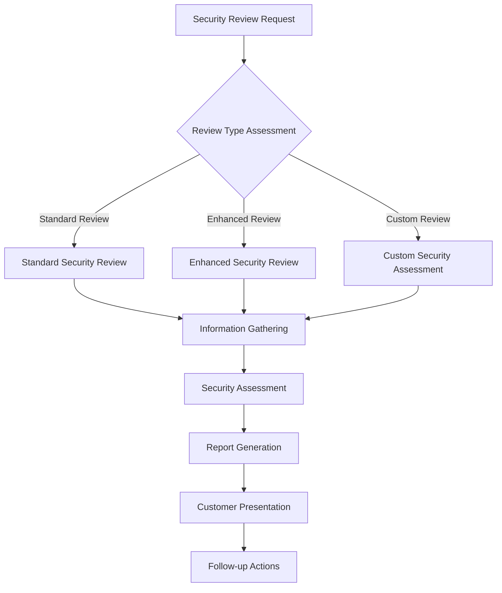
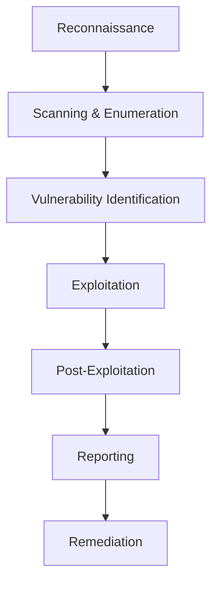

# Customer Security Program

## Executive Summary

This program establishes a comprehensive approach to customer security that builds trust through transparency, collaboration, and shared security responsibility. By providing customers with visibility into our security practices, tools, and processes, we transform security from a compliance requirement into a competitive advantage that drives customer confidence and business growth.

**Key Objectives:**
- **Customer Trust Building** - Demonstrate security excellence through transparency
- **Collaborative Security** - Partner with customers on shared security responsibilities
- **Competitive Differentiation** - Use security as a market differentiator
- **Incident Coordination** - Ensure coordinated response to customer-impacting incidents

**Target Audience:** Sales teams, Customer Success, Account Managers, Security teams, and Customer Support.

---

## Introduction: Security as a Customer Value Proposition

In today's security-conscious business environment, customers increasingly evaluate vendors based on their security capabilities and transparency. Rather than treating security as a cost center, we position it as a value proposition that builds customer trust and drives business success.

This program provides customers with visibility into our security practices while maintaining appropriate confidentiality for sensitive security details. It creates a partnership model where security becomes a shared responsibility and competitive advantage.

## Customer Security Documentation Portal

### 1. Portal Architecture and Content

#### Portal Structure

**Home Page: Security Overview**
- Company security philosophy and commitment
- Key security certifications and compliance status
- Recent security achievements and milestones
- Contact information for security inquiries
- Link to customer security resources

**Security Certifications Page**
- **SOC 2 Type II Report** - Executive summary and key controls
- **ISO 27001 Certification** - Scope, controls, and certificate details
- **Industry-Specific Certifications** - PCI DSS, HIPAA, FedRAMP, etc.
- **Penetration Testing Results** - High-level methodology and summary
- **Third-Party Assessments** - Independent security audit results

**Security Infrastructure Page**
- **Architecture Overview** - High-level security architecture diagram
- **Data Protection** - Encryption, data classification, and protection measures
- **Network Security** - Firewall, segmentation, and monitoring capabilities
- **Identity and Access Management** - Authentication and authorization controls
- **Vulnerability Management** - Processes and procedures for vulnerability management

**Compliance and Regulations Page**
- **Compliance Frameworks** - Regulatory compliance overview
- **Data Privacy** - GDPR, CCPA, and privacy protection measures
- **Industry Regulations** - Industry-specific compliance requirements
- **Audit Processes** - Internal and external audit procedures
- **Compliance Certificates** - Downloadable compliance documentation

**Security Tools and Processes Page**
- **Secure Development** - Secure software development lifecycle
- **Security Testing** - SAST, DAST, and penetration testing processes
- **Incident Response** - Incident response capabilities and procedures
- **Security Monitoring** - 24/7 security monitoring and response
- **Employee Security** - Security training and awareness programs

#### Portal Content Management

**Content Categories:**

| Content Type | Access Level | Update Frequency | Owner |
| :--- | :--- | :--- | :--- |
| **Security Overview** | Public | Quarterly | Security Marketing |
| **Certifications** | Customer | Annually | Compliance Team |
| **Security Policies** | Customer | As needed | Security Policy Team |
| **Incident Response** | Customer | After incidents | Incident Response Team |
| **Technical Details** | Customer | Quarterly | Security Engineering |
| **Compliance Reports** | Customer | Annually | Compliance Team |

**Content Approval Process:**
1. **Content Creation** - Subject matter expert creates content
2. **Review Process** - Security team review for accuracy and completeness
3. **Legal Review** - Legal team review for compliance and risk
4. **Executive Approval** - Security leadership final approval
5. **Publication** - Published to customer portal with appropriate access controls
6. **Monitoring** - Regular monitoring for accuracy and relevance

### 2. Portal Technology and Security

#### Portal Security Requirements

**Access Control:**
- **Multi-Factor Authentication** - Required for all portal access
- **Role-Based Access** - Different access levels for different content
- **Session Management** - Secure session handling and timeout
- **Audit Logging** - Complete audit trail of all portal activities
- **Data Encryption** - All data in transit and at rest encrypted

**Technical Requirements:**
- **High Availability** - 99.9% uptime with disaster recovery
- **Performance** - Fast load times and responsive design
- **Mobile Compatibility** - Responsive design for mobile devices
- **Accessibility** - WCAG 2.1 AA compliance for accessibility
- **Search Capability** - Full-text search of all portal content

**Integration Points:**
- **CRM Integration** - Link to customer account information
- **Support Systems** - Integration with customer support platforms
- **Security Tools** - Integration with security monitoring and alerting
- **Compliance Systems** - Integration with compliance management tools
- **Analytics** - Integration with web analytics and usage tracking

#### Portal Implementation

```yaml
# Example portal infrastructure configuration
portal_infrastructure:
  infrastructure:
    - cdn: "CloudFlare CDN for global distribution"
    - hosting: "AWS S3 + CloudFront for static content"
    - database: "Amazon RDS PostgreSQL for dynamic content"
    - caching: "Amazon ElastiCache Redis for performance"

  security:
    - authentication: "AWS Cognito with MFA"
    - authorization: "Fine-grained access controls"
    - encryption: "TLS 1.3 for all communications"
    - monitoring: "AWS CloudWatch and GuardDuty"

  content_management:
    - cms: "WordPress with security hardening"
    - version_control: "Git-based content management"
    - approval_workflow: "Multi-level approval process"
    - backup: "Automated daily backups with 30-day retention"
```

### 3. Portal Content Examples

#### Security Overview Content Template

**"Our Security Commitment"**

"At [Company Name], security is not just a requirement—it's a core value that guides everything we do. We believe that strong security practices build customer trust and enable business success. Our comprehensive security program protects our customers' data while ensuring the reliability and availability of our services.

**Key Security Highlights:**

✅ **ISO 27001 Certified** - Internationally recognized information security management
✅ **SOC 2 Type II Compliant** - Annual independent audit of security controls
✅ **24/7 Security Monitoring** - Continuous monitoring and threat detection
✅ **Regular Penetration Testing** - Independent security testing by third-party experts
✅ **Employee Security Training** - All employees receive regular security training
✅ **Data Protection** - Comprehensive data encryption and protection measures"

#### Certifications Page Content Template

**"Our Security Certifications"**

**SOC 2 Type II Report**
Our SOC 2 Type II report demonstrates our commitment to security and operational excellence. The report provides independent assurance that our security controls are suitably designed and operating effectively.

**Key SOC 2 Controls:**
- Security - Comprehensive controls to protect customer data
- Availability - Controls ensuring service availability and reliability
- Processing Integrity - Controls ensuring accurate and complete processing
- Confidentiality - Controls protecting sensitive information from unauthorized access
- Privacy - Controls protecting personal information in accordance with privacy principles

**Access Information:**
- Current customers can request the full SOC 2 Type II report
- Reports are updated annually following independent audits
- Executive summaries available for all visitors

## Customer Security Review Process

### 1. Security Review Types

#### New Customer Security Review

**Review Triggers:**
- New enterprise customer onboarding
- Customer requests for security information
- Regulatory or compliance requirements
- High-value contracts or partnerships
- Customer-specific security requirements

**Review Process:**


**Standard Review Components:**
- Security policies and procedures overview
- Compliance certifications and status
- Technical security controls summary
- Incident response capabilities overview
- Security training and awareness programs
- Q&A session with security team

**Enhanced Review Components (Standard +):**
- Detailed technical security controls
- Specific compliance mappings
- Custom security requirement assessment
- Architecture review (if applicable)
- On-site assessment options
- Detailed implementation roadmap

**Custom Review Components:**
- Customer-specific security requirements
- Custom security assessments
- Specialized compliance evaluations
- Third-party security assessments
- Custom reporting and documentation
- Ongoing security partnership programs

#### Ongoing Customer Security Reviews

**Regular Review Schedule:**
- **Quarterly Check-ins** - High-touch customers
- **Semi-annual Reviews** - Mid-tier customers
- **Annual Reviews** - Standard customers
- **Ad-hoc Reviews** - As requested or required

**Review Content:**
- Security program updates and improvements
- New certifications or compliance achievements
- Recent security incidents or events (as appropriate)
- Emerging threat landscape and mitigation measures
- Customer feedback and improvement suggestions
- Upcoming security initiatives and roadmap

### 2. Security Review Workflow

#### Request Intake and Triage

**Request Channels:**
- **Sales Team** - Security review requests during sales process
- **Customer Success** - Ongoing customer security review requests
- **Customer Support** - Customer security inquiries and escalations
- **Direct Customer** - Direct requests from customer security teams
- **Partner Channels** - Partner-driven security review requests

**Triage Process:**
1. **Request Logging** - Log all security review requests in tracking system
2. **Customer Classification** - Determine customer tier and review requirements
3. **Scope Definition** - Define scope and objectives of security review
4. **Resource Allocation** - Assign appropriate security team members
5. **Timeline Development** - Establish realistic timeline and milestones

#### Information Gathering and Analysis

**Information Requirements:**

| Customer Category | Required Information | Collection Method |
| :--- | :--- | :--- |
| **Enterprise** | Full security assessment questionnaire | Customer portal, Direct interview |
| **Mid-Market** | Standard security questionnaire | Customer portal, Email |
| **Small Business** | Key security information | Customer portal, Self-service |
| **Government** | Comprehensive security assessment | Secure portal, Direct engagement |

**Analysis Process:**
1. **Information Validation** - Verify accuracy and completeness of provided information
2. **Gap Analysis** - Identify gaps between customer requirements and our capabilities
3. **Risk Assessment** - Assess security risks and mitigation measures
4. **Recommendation Development** - Develop security recommendations and improvements
5. **Report Generation** - Create comprehensive security review report

#### Customer Presentation and Follow-up

**Presentation Preparation:**
- **Customized Content** - Tailor presentation to customer needs and requirements
- **Executive Summary** - High-level overview for executive audience
- **Technical Details** - Detailed information for technical audience
- **Live Q&A Session** - Open forum for questions and discussion
- **Documentation Package** - Comprehensive documentation package

**Follow-up Activities:**
- **Feedback Collection** - Gather customer feedback on review process and content
- **Action Item Tracking** - Track and manage any follow-up actions or commitments
- **Relationship Building** - Build ongoing security partnership relationship
- **Continuous Improvement** - Use feedback to improve security review processes
- **Regular Communication** - Maintain regular security communication cadence

## Penetration Testing Coordination

### 1. Customer-Initiated Penetration Testing

#### Testing Request Process

**Request Channels:**
- **Customer Security Team** - Direct requests from customer security personnel
- **Customer Procurement** - Contractual penetration testing requirements
- **Regulatory Requirements** - Regulatory or compliance-driven testing
- **Partnership Programs** - Partnership or integration testing requirements
- **Sales Process** - Pre-contract penetration testing requirements

**Request Assessment:**
1. **Request Validation** - Validate request legitimacy and scope
2. **Legal Review** - Legal team review of testing requirements
3. **Risk Assessment** - Assess potential risks and impacts
4. **Resource Planning** - Plan resources and timeline for testing
5. **Customer Agreement** - Formal agreement on testing scope and rules

#### Testing Coordination Framework

**Pre-Testing Phase:**

| Activity | Responsibility | Timeline | Documentation |
| :--- | :--- | :--- | :--- |
| **Testing Agreement** | Legal & Security | 1-2 weeks | Testing agreement, Rules of engagement |
| **Scope Definition** | Security Team | 1 week | Testing scope, Exclusions, Limitations |
| **Communication Plan** | Account Management | 1 week | Communication plan, Escalation procedures |
| **Technical Coordination** | Security Engineering | 1 week | Technical requirements, Access procedures |
| **Resource Allocation** | Security Operations | 1 week | Team assignment, Tool preparation |

**Testing Phase:**
- **Testing Execution** - Conduct penetration testing according to agreed scope
- **Progress Monitoring** - Regular progress updates and communication
- **Issue Management** - Immediate notification of critical findings
- **Scope Adjustments** - Handle any necessary scope changes or modifications
- **Documentation** - Comprehensive testing documentation and evidence

**Post-Testing Phase:**
- **Findings Review** - Review and validate testing findings
- **Remediation Planning** - Develop remediation plans for identified issues
- **Report Generation** - Create comprehensive penetration testing report
- **Customer Presentation** - Present findings to customer stakeholders
- **Follow-up Actions** - Track remediation activities and validation

### 2. Third-Party Testing Coordination

#### Customer-Selected Testing Providers

**Provider Vetting Process:**
- **Provider Qualification** - Validate testing provider credentials and experience
- **Insurance Verification** - Verify professional liability insurance coverage
- **Reputation Check** - Check provider reputation and references
- **Methodology Review** - Review testing methodology and approach
- **Agreement Review** - Legal review of testing agreements and terms

**Coordination Requirements:**
- **Testing Agreement** - Tri-party agreement between company, customer, and provider
- **Rules of Engagement** - Clear testing scope, limitations, and procedures
- **Communication Protocol** - Communication channels and escalation procedures
- **Technical Coordination** - Technical requirements and access procedures
- **Incident Response** - Procedures for handling incidents during testing

#### Testing Support and Oversight

**Company Support Requirements:**
- **Technical Environment** - Provide access to testing environment as required
- **Security Monitoring** - Monitor testing activities for unauthorized access
- **Incident Response** - Respond to any incidents or issues during testing
- **Documentation** - Provide necessary documentation and information
- **Coordination** - Coordinate testing activities with internal teams

**Quality Assurance:**
- **Testing Oversight** - Monitor testing quality and thoroughness
- **Finding Validation** - Validate and verify testing findings
- **Methodology Review** - Review testing methodology and approach
- **Report Review** - Review and validate testing reports and findings
- **Follow-up Validation** - Validate remediation activities and effectiveness

### 3. Penetration Testing Process Management

#### Testing Process Standardization

**Testing Types:**
- **Network Penetration Testing** - External and internal network security testing
- **Web Application Testing** - Web application security testing
- **Mobile Application Testing** - Mobile app security testing
- **API Testing** - API security testing and validation
- **Social Engineering** - Human factor security testing
- **Physical Security Testing** - Physical security assessment (if applicable)

**Testing Methodology:**


**Quality Standards:**
- **OWASP Testing Guide** - Follow industry-standard testing methodologies
- **PTES Framework** - Use Penetration Testing Execution Standard
- **NIST Standards** - Align with NIST cybersecurity frameworks
- **Industry Best Practices** - Follow industry-specific best practices
- **Custom Requirements** - Address customer-specific requirements and concerns

## Customer Incident Notification Procedures

### 1. Incident Communication Framework

#### Communication Principles

**Transparency with Security:**
- **Honest Communication** - Provide accurate and complete information
- **Appropriate Detail** - Provide sufficient detail without compromising security
- **Timely Notification** - Notify customers promptly with relevant information
- **Consistent Messaging** - Ensure consistent communication across all channels
- **Empathy and Support** - Provide support and guidance during incidents

**Communication Tiers:**

| Incident Severity | Notification Method | Timing | Communication Content |
| :--- | :--- | :--- | :--- |
| **Critical** | Direct contact, Email, Portal | Within 1 hour | Incident overview, Impact, Immediate actions |
| **High** | Email, Portal, Phone | Within 4 hours | Incident details, Impact assessment, Timeline |
| **Medium** | Email, Portal | Within 24 hours | Incident information, Resolution timeline |
| **Low** | Email, Portal | Within 72 hours | Incident summary, Resolution details |

#### Communication Templates

**Critical Incident Notification Template:**

**Subject:** URGENT: Security Incident Affecting [Service/Product]

**Dear [Customer Name],**

We are writing to inform you of a security incident that may affect your use of [Service/Product]. We are taking this matter very seriously and want to provide you with immediate information about the situation.

**Incident Overview:**
- **Date and Time:** [Date/Time of incident detection]
- **Service Affected:** [Specific service or product]
- **Current Status:** [Current incident status]
- **Impact Assessment:** [Known or potential impact]

**Immediate Actions:**
- [List of immediate actions taken]
- [Current mitigation measures]
- [Estimated timeline for resolution]

**Next Steps:**
- We will provide regular updates every [X hours]
- [Specific actions customers should take]
- [Customer support contact information]

**Contact Information:**
- Security Team: [Contact information]
- Customer Support: [Contact information]
- Incident Response Hotline: [Contact information]

We apologize for any inconvenience this may cause and appreciate your patience as we work to resolve this issue.

**Best regards,**
[Company Name] Security Team

### 2. Customer-Specific Incident Response

#### Customer Impact Assessment

**Impact Analysis Process:**
1. **Customer Identification** - Identify affected customers and systems
2. **Impact Determination** - Assess potential impact on customers
3. **Severity Classification** - Classify incident severity for customer communication
4. **Communication Planning** - Develop customer-specific communication plan
5. **Support Coordination** - Coordinate customer support and assistance

**Impact Assessment Criteria:**
- **Data Exposure** - Customer data potentially exposed or compromised
- **Service Availability** - Impact on service availability and performance
- **Security Controls** - Effectiveness of existing security controls
- **Regulatory Requirements** - Regulatory or compliance notification requirements
- **Customer Risk** - Potential risk to customer systems or data

#### Customer Support Coordination

**Support Team Preparation:**
- **Incident Briefing** - Brief customer support teams on incident details
- **Response Scripts** - Develop response scripts for common customer questions
- **Escalation Procedures** - Establish escalation procedures for customer issues
- **Resource Allocation** - Allocate appropriate support resources
- **Communication Channels** - Establish dedicated communication channels

**Customer Support Activities:**
- **Proactive Outreach** - Proactively contact affected customers
- **Information Provision** - Provide information and guidance to customers
- **Technical Assistance** - Provide technical support for customer systems
- **Issue Resolution** - Help customers resolve any issues caused by incident
- **Follow-up Support** - Ongoing support until incident resolution

### 3. Post-Incident Customer Communication

#### Incident Resolution Communication

**Resolution Notification Template:**

**Subject:** Incident Resolution: [Incident Title]

**Dear [Customer Name],**

We are pleased to inform you that the security incident affecting [Service/Product] has been resolved. We want to provide you with complete information about the resolution and any actions you may need to take.

**Resolution Summary:**
- **Resolution Date and Time:** [Date/Time of resolution]
- **Root Cause:** [Brief description of root cause]
- **Resolution Actions:** [Description of resolution actions]
- **Customer Impact:** [Assessment of impact on customers]

**Post-Incident Actions:**
- [List of post-incident actions taken]
- [Security improvements implemented]
- [Monitoring and prevention measures]
- [Customer recommendations or requirements]

**Ongoing Monitoring:**
- [Description of ongoing monitoring activities]
- [Customer monitoring recommendations]
- [Future security improvements planned]
- [Contact information for ongoing support]

**Apology and Appreciation:**
- [Apology for the incident and any inconvenience]
- [Appreciation for customer patience and cooperation]
- [Commitment to future security improvements]

**Contact Information:**
- [Contact information for follow-up questions]
- [Customer support contact information]
- [Security team contact information]

**Best regards,**
[Company Name] Security Team

#### Lessons Learned Communication

**Lessons Learned Sharing:**
- **Incident Summary** - Summary of incident and lessons learned
- **Improvement Actions** - Security improvements implemented
- **Prevention Measures** - New prevention measures and controls
- **Customer Recommendations** - Recommendations for customer security improvements
- **Future Communication** - Plans for future security communication

## Implementation Roadmap

### Phase 1: Foundation (Months 1-3)

**Month 1: Program Setup**
- [ ] Customer security program charter and objectives
- [ ] Customer security requirements gathering
- [ ] Security review process development
- [ ] Initial customer security documentation

**Month 2: Portal Development**
- [ ] Customer security portal design and development
- [ ] Initial content creation and review
- [ ] Portal security and access controls
- [ ] Beta testing with select customers

**Month 3: Process Implementation**
- [ ] Security review process implementation
- [ ] Customer communication templates development
- [ ] Support team training and preparation
- [ ] Initial customer security reviews

### Phase 2: Expansion (Months 4-6)

**Month 4: Program Expansion**
- [ ] Expand customer security reviews to all customers
- [ ] Enhance customer security portal content
- [ ] Implement customer feedback mechanisms
- [ ] Develop customer security metrics

**Month 5: Testing Coordination**
- [ ] Penetration testing coordination process
- [ ] Third-party testing provider relationships
- [ ] Testing coordination procedures
- [ ] Testing quality assurance processes

**Month 6: Incident Response Integration**
- [ ] Customer incident notification procedures
- [ ] Customer support coordination processes
- [ ] Post-incident communication templates
- [ ] Customer incident response integration

### Phase 3: Optimization (Months 7-12)

**Months 7-9: Advanced Features**
- [ ] Advanced customer security analytics
- [ ] Customer security scorecards
- [ ] Automated security reporting
- [ ] Customer security insights

**Months 10-12: Program Maturation**
- [ ] Customer security partnership programs
- [ ] Advanced customer collaboration
- [ ] Customer security innovation programs
- [ ] Program effectiveness measurement

## Tools and Technologies

### Customer Portal Technology

| Technology | Purpose | Integration | Features |
| :--- | :--- | :--- | :--- |
| **WordPress** | Content Management | Security tools, CRM | Custom themes, Security plugins |
| **AWS S3** | Static Content Storage | CDN, CloudFront | High availability, Scalability |
| **CloudFlare** | CDN and Security | DNS, Load Balancing | DDoS protection, SSL, Caching |
| **Auth0** | Authentication | CRM, Support tools | MFA, SSO, User management |
| **Zendesk** | Customer Support | CRM, Portal | Ticketing, Knowledge base, Live chat |

### Security Review Tools

| Tool Category | Examples | Use Cases | Integration |
| :--- | :--- | :--- | :--- |
| **Questionnaire Tools** | Qualtrics, SurveyMonkey | Security assessments | Customer portal, CRM |
| **Document Management** | Confluence, SharePoint | Security documentation | Customer portal |
| **Collaboration Tools** | Slack, Microsoft Teams | Customer communication | Internal collaboration |
| **Analytics Tools** | Google Analytics, Mixpanel | Portal usage analytics | Portal optimization |
| **Video Conferencing** | Zoom, Teams | Virtual security reviews | Customer presentations |

### Communication Platforms

| Platform | Features | Use Cases | Security |
| :--- | :--- | :--- | :--- |
| **Email Marketing** | Campaign management, Templates | Customer communications | Secure email delivery |
| **Web Conferencing** | Video calls, Screen sharing | Virtual meetings | End-to-end encryption |
| **Customer Portals** | Secure document sharing | Documentation access | Role-based access control |
| **Messaging Platforms** | Real-time communication | Customer support | Message encryption |
| **Survey Tools** | Feedback collection | Customer satisfaction | Data privacy compliance |

## Metrics and Success Factors

### Customer Security Metrics

| Metric | Target | Measurement Method |
| :--- | :--- | :--- |
| **Customer Security Satisfaction** | > 90% satisfaction | Customer surveys |
| **Security Review Completion Rate** | 100% of customers | Review tracking system |
| **Portal Usage** | > 80% of customers access quarterly | Portal analytics |
| **Security Document Downloads** | > 500 downloads per month | Portal analytics |
| **Customer Security Questions** | < 24 hours response time | Support ticket tracking |

### Business Impact Metrics

| Metric | Target | Measurement Method |
| :--- | :--- | :--- |
| **Sales Enablement** | 20% increase in security-related deals | Sales tracking |
| **Customer Retention** | 95% customer retention rate | Customer success metrics |
| **Customer Satisfaction** | > 4.5/5.0 satisfaction score | Customer surveys |
| **Competitive Differentiation** | Top 3 security differentiators | Market analysis |
| **Revenue Impact** | 10% revenue growth from security features | Financial analysis |

### Process Efficiency Metrics

| Metric | Target | Measurement Method |
| :--- | :--- | :--- |
| **Security Review Turnaround** | < 5 business days | Process tracking |
| **Documentation Update Frequency** | Monthly updates | Content management system |
| **Customer Response Time** | < 2 hours for critical issues | Support ticket metrics |
| **Portal Performance** | < 2 second load time | Performance monitoring |
| **Customer Support Metrics** | < 90% first-call resolution | Support system analytics |

## Governance and Management

### Program Governance

| Role | Responsibilities | Authority |
| :--- | :--- | :--- |
| **Customer Security Manager** | Program oversight, Strategy development | Program decisions, Budget allocation |
| **Customer Security Analyst** | Security reviews, Customer communication | Review decisions, Content approval |
| **Portal Manager** | Portal management, Content creation | Portal content, Technical decisions |
| **Customer Support Lead** | Customer support coordination | Support processes, Team decisions |
| **Sales Security Liaison** | Sales process security support | Sales enablement, Customer communication |

### Management Processes

| Activity | Frequency | Owner | Process |
| :--- | :--- | :--- | :--- |
| **Program Review** | Monthly | Program Manager | Program effectiveness review |
| **Portal Updates** | Monthly | Portal Manager | Content updates and maintenance |
| **Customer Feedback** | Quarterly | Customer Success | Feedback collection and analysis |
| **Process Improvement** | Quarterly | All Teams | Process optimization and enhancement |
| **Performance Review** | Annually | Program Manager | Program performance assessment |

## Related Documents

- [Advanced Threat Intelligence Program](../12.%20Advanced%20Threat%20Intelligence/Advanced%20Threat%20Intelligence%20Program.md)
- [Incident Response Plan](../8.%20Incident%20Response/README.md)
- [Security Training & Culture Program](../10.%20Security%20Training%20&%20Culture/Security%20Training%20&%20Culture%20Program.md)
- [Secure Infrastructure Standard](../1.%20Developer%20Documentation/Infrastructure/Secure%20Infrastructure%20Standard.md)
- [Application Security Compliance Checklist](../3.%20Application%20Coding%20Checklist/Application%20Security%20Compliance%20Checklist.md)

## Review and Maintenance

This document should be reviewed quarterly and updated as follows:
- **Monthly:** Customer feedback and portal content updates
- **Quarterly:** Program effectiveness review and metrics analysis
- **Annually:** Strategic program alignment and customer requirements review

Document Owner: Customer Security Program Team
Last Updated: [Current Date]
Next Review Date: [Quarterly Schedule]

---

**Appendix A: Customer Security Questionnaire Template**

[Comprehensive questionnaire template for customer security assessments]

**Appendix B: Customer Security Review Process Templates**

[Standardized templates for different types of customer security reviews]

**Appendix C: Penetration Testing Coordination Templates**

[Templates for coordinating customer-initiated penetration testing]

**Appendix D: Customer Incident Communication Templates**

[Comprehensive templates for customer incident communication]

**Appendix E: Customer Security Metrics Dashboard**

[Dashboard design and metrics for tracking customer security program effectiveness]